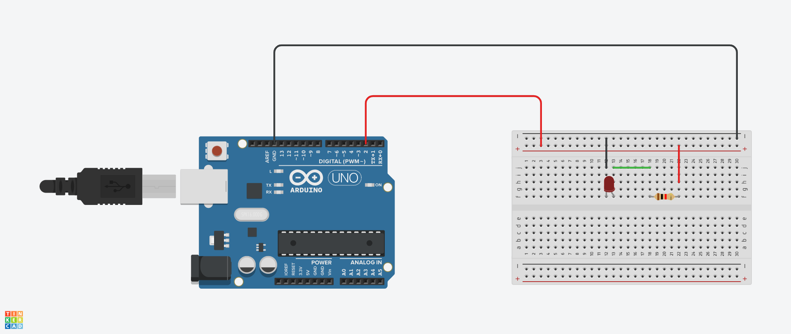
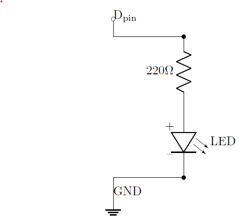
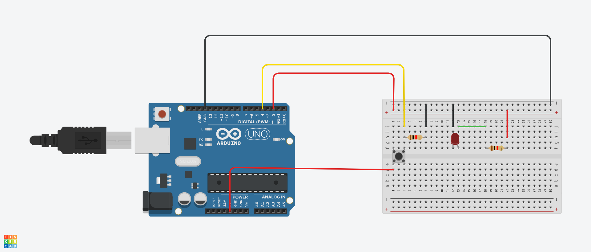
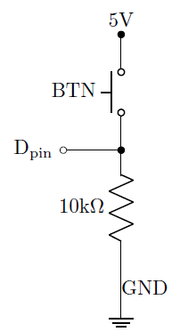
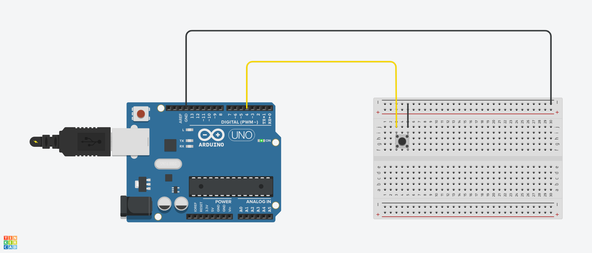
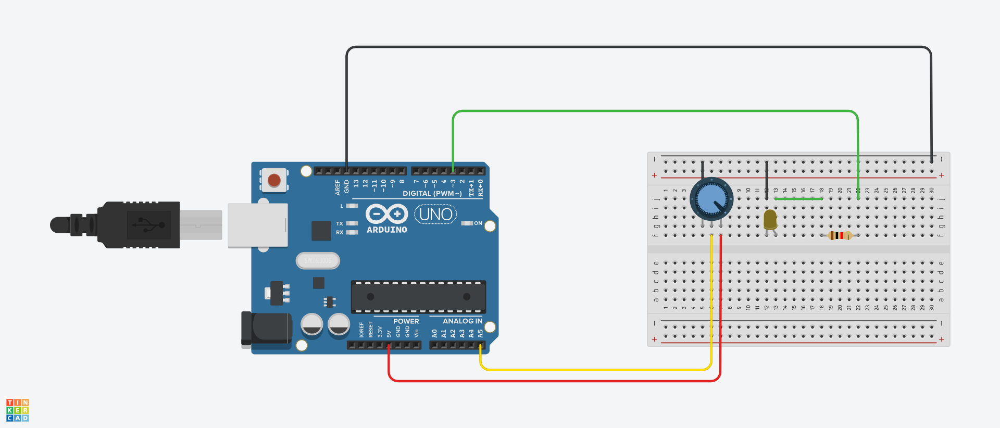

# led

## builtin led

```cpp
void setup() {
    pinMode(LED_BUILTIN, OUTPUT);
}

void loop() {
    digitalWrite(LED_BUILTIN, HIGH);
    delay(500);
    digitalWrite(LED_BUILTIN, LOW);
    delay(500);
}
```

---

## external led

```cpp
const byte led_pin = 2;

void setup() {
    pinMode(led_pin, OUTPUT);
}

void loop() {
    digitalWrite(led_pin, HIGH);
    delay(500);
    digitalWrite(led_pin, LOW);
    delay(500);
}
```





## led by button

使用下拉電阻 / pull-down resistor

```cpp
const byte led_pin = 2;
const byte btn_pin = 4;

void setup() {
    pinMode(led_pin, OUTPUT);
    pinMode(btn_pin, INPUT);  // button 需架設 pull-down resistor
    Serial.begin(9600);
}

void loop() {
    bool btn_state = digitalRead(btn_pin);  // on -> 1, off -> 0
    Serial.println(btn_state);
    digitalWrite(led_pin, btn_state);
}
```





```cpp
const byte led_pin = 4;

void setup() {
    pinMode(LED_BUILTIN, OUTPUT);
    pinMode(led_pin, INPUT_PULLUP); // 使用 arduino 內部 pull-up resistor
    Serial.begin(9600);
}

void loop() {
  bool btn_state = digitalRead(led_pin); // on -> 0, off -> 1
  Serial.println(btn_state);
  digitalWrite(LED_BUILTIN, !btn_state);
}
```



---

## led by variable resistor

```cpp
const int led_pin = 3;
const byte sen_pin = A5;
int sen_val=0;

void setup()
{
    pinMode(pin, OUTPUT);
}

void loop()
{
    sen_val = analogRead(sen_pin);
    sen_val = map(sen_val, 0, 1023, 0, 255);
    analogWrite(led_pin, sen_val);
}
```


