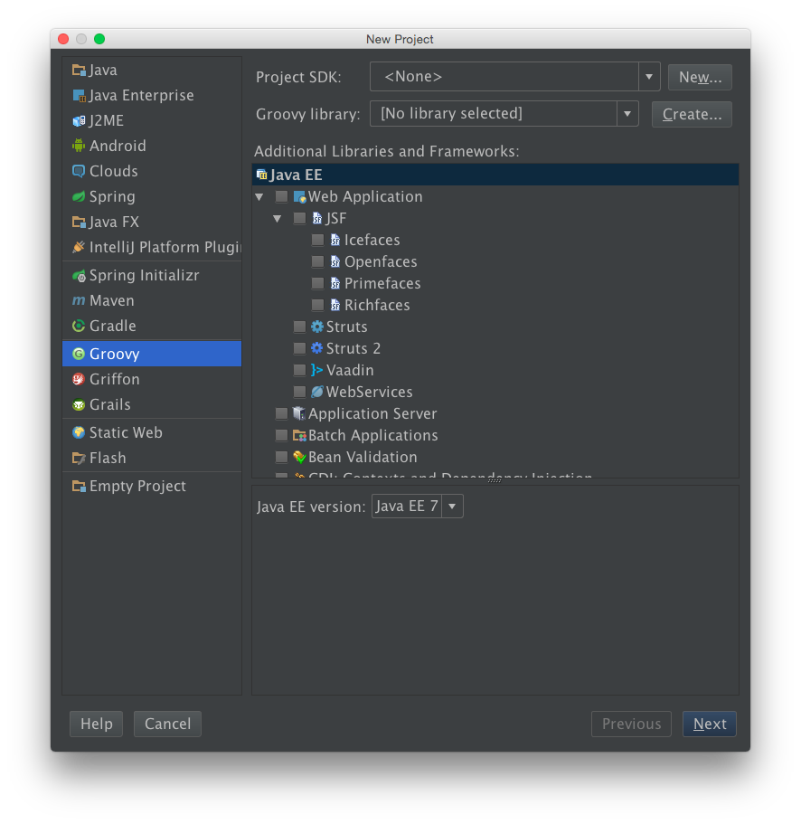
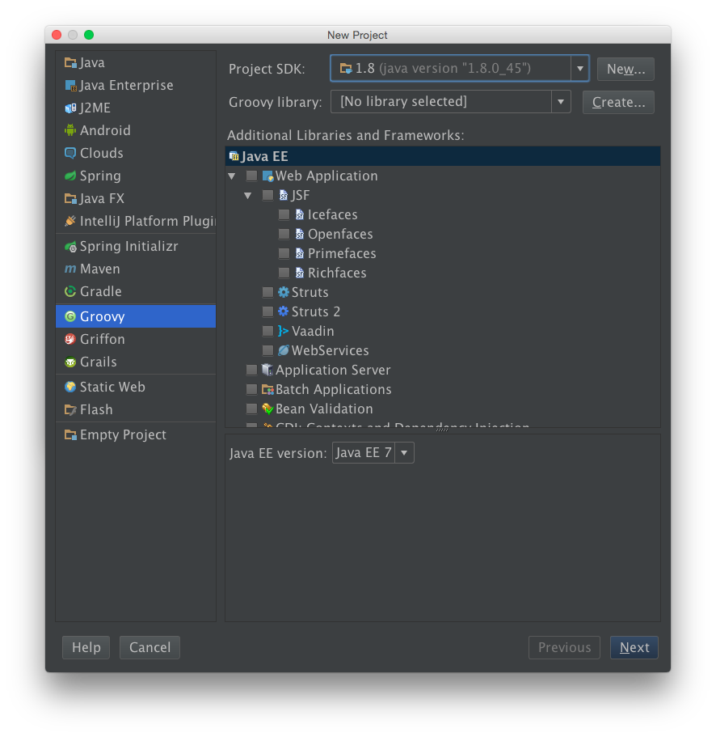
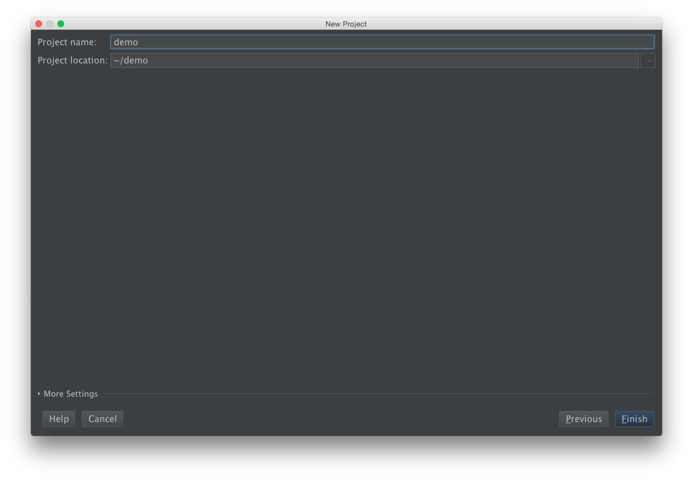
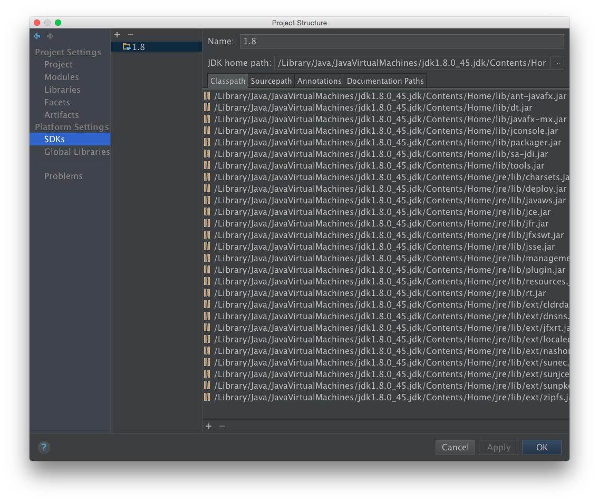

# 簡介

  Groovy 在 2003 年問世, Apache Software Foundation 的軟體工程師 James Strachan 創造, 目前專案的負責人是 Guillaume LaForge. Groovy 是自由軟體, 採用 Apache 2.0 開放原始碼授權, 第一個正式版本 1.0 在 2007 發佈, 2012 年發佈 2.0 版本後.

  Groovy 語法大致上和 Java 語言相似; 卻比 Java 更容易學習與使用, 比更適合剛入門學習寫程式的初學者. 已熟悉 Java 的開發者, 很快就能學會使用 Groovy 寫程式. 

# 安裝

Groovy 可以使用 RPM, DPKG 等系統內建套件直接安裝, 但 Linux, MacOSX, FreeBSD 建議使用 SDKMAN (Software Development Kit MANager), 前身為 GVM (Groovy enVironment Manager) 安裝管理. 因為 Groovy 會使用到 Java, 須先安裝 JDK 6+ (Java Development Kit), 建議 JDK 8+. 使用 SDKMAN 安裝 end user 即可, 不需要 admin.

	# install jdk, 這裏使用安裝 openjdk 
	Linux:~ # yum install -y java-1.8.0-openjdk-devel
	Linux:~ # echo $JAVA_HOME            # 確認 Java 環境變數

在安裝 sdk 之後, 會在寫入 $HOME/.bashrc $HOME/.bash_profile, $HOME/.zshrc 加入環境設定. 而 sdkman 套件安裝在 $HOME/.sdkman 底下

	# install sdk
	Linux:~ $ curl -s get.sdkman.io | bash
	Linux:~ $ cat ~/.bashrc
	source "$HOME/.sdkman/bin/sdkman-init.sh"

	# install groovy
	Linux:~ $ sdk list
	Linux:~ $ sdk install groovy
	Linux:~ $ echo $GROOVY_HOME         # 確認 Groovy 環境變數

# 使用環境

## command mode / 指令模式

	Linux:~ $ groovy -e "println 'Hi, Groovy'"

## script mode / 指令稿模式

	Linux:~ $ cat hi.groovy
	println 'Hi, Groovy'
	Linux:~ $ groovy hi.groovy

## inactive mode / 互動模式

	Linux:~ $ export EDITOR=vim
	Linux:~ $ groovysh
	groovy> println 'Hi, Groovy'       // 輸入指令方式執行
	groovy> :load hi.groovy            // 載入檔案方式執行

	groovy> :edit                      // 使用編輯方式
	def abc() {
	    println "abc"
	}
	groovy> abc

	groovy> :show all                  // 顯示已設定 variable, class, import

	groovy> [].getClass()              // 回傳 class java.util.ArrayList
	groovy> :doc java.util.ArrayList   // 查詢 java.util.ArrayList doc

# IDE

## IntelliJ IDEA 設定

1. 建立新專案

  

2. 設定 JDK 和 Groovy Library

  

  2.1 設定 JDK

  

  預設 JDK 路徑為 $JAVA_HOME

  2.2 完成後可看到 Project SDK 有套用剛剛設定

  

  2.3 同樣的方式設定 Groovy library (因為這裡是寫 Groovy Project)

  

  預設 library 路徑為 $GROOVY_HOME

3. 設定專案名稱

  

4. 開始寫程式

  

  注意, External Library 處表示此專案執行時會用到 Library

5. 修改 External Library 設定 (若有需要)

  到 File \ Project Structure 開啟

  

  5.1 Project 設定 Project name 和 Project SDK

  

  5.2 Modules

  

  5.3 Labraries (For the project)

  

  5.4 SDKs 設定可用 SDK

  

  5.5 Global Labraries (For all project)

# 資料型態

Groovy 像一般 script language 一樣是 dynamic type, 使用時不需要先定義形別. 也可像 Java 一樣, 使用前先定義資料型態 (支援 Java 所定義的資料型態). def 

## Numeric / 數值

	i = 10
	int j = 20
	Integer k = 30
	def l = 40

## String / 字串

' (單引號), "(雙引號)

	// single line string
	println "don't say \"no\""

	println 'don\'t say "no"'

	// multiple line string
	println """foo
	bar"""

	println '''foo
	bar'''

	// string interpolation
	println "1 + 1 = ${1 + 1}"

	var = 10
	println "var = ${var}"

	// string concatenation
	println "Hi, " + "Groovy"

## ArrayList /

arraylist 像是其他一般語言的陣列 (array), index 從 0 開始, 和陣列不一樣的, arraylist 不需要宣告型別, arraylist 可裝任何型別. arraylist 在 assign value 時, 是 copy by reference 而非 copy by value

	// assign value
	list1 = []                   // empty arraylist
	println("list1: " + list1 + ", list1 type: " + list1.getClass())
	list1 = ["ABC", 'xyz', 123]

	list1 = ["ABC", 'xyz', 123]
	list2 = list1                // call by reference
	list3 = list1[0..-1]         // call by value

	println "list1: " + list1
	println "list2: " + list2
	println "list3: " + list3

	// operation
	list1.remove(0)              // remove element
	println "list1: " + list1
	println "list2: " + list2
	println "list3: " + list3
	list1.add('Last')            // append element
	list1 << 'Last'              // append element
	list1.add(0, 'First')        // insert element
	println list1.sort()         // sort arraylist
	println list1.reverse()      // reverser arraylist

	// condition
	println 'xyz' in list1
	println list1.empty

	// loop
	for (i = 0; i < list1.size(); i++)
	    println "${list1[i]}"

	for (e in list1)
	    println("${e}")

	// closure 用法
	list1.each { e ->
	    println (e)
	}

	list1.each {                // it 為預設 iterator
	    println "${it}"
	}

	// ArrayList and String
	println ['abc', 'XYZ', '123'].join(", ")  // ArrayList to String
	println "abc,XYZ,123".split(',')          // String to ArrayList

## HashMap /

hashmap 像是其他一般語言的關聯式陣列 (associative array),

	// assign value
	hash1 = [:]
	println("hash1: " + hash1 + ", hash1 type: " + hash1.getClass())

	hash1 = ['A': 'ABC', "x": "xyz", "0": 123]
	hash2 = hash1               // call by reference

	// operation
	hash1.put('Sun', "Sunday")  // add element
	hash1['Mon'] = 'Monday'     // 同上
	hash1.Tues = 'Tuesday'      // 同上
	hast1.remove(A)             // delete element
	println "hash1" + hash1
	println hash2
	println hash1.keySet()
	println hash1.values()
	println hash1['Sun']        // 顯示該 key value 
	println hash1.Sun           // 同上

	// condition
	println hash1.containsKey('xyz')
	println hash1.containsValue('xyz')
	println hash1.isEmpty()

	// loop
	for (e in hash1)
	    println "${e.key}: ${e.value}"

	// closure 用法
	hash1.each { k, v ->
	    println("$k: $v")
	}

	hash1.each {           // it 為預設 iterator
	    println "${it.key}: ${it.value}"
	}

# 控制流程

## if-else

	// if-else 範例
	if (System.properties['os.name'] == 'Linux')
	    os = 'Linux'
	else
	    os = 'Unknown'
	println os

	// if-eles 改用 ternary
	os = (System.properties['os.name'] == 'Linux') ? 'Linux' : 'Unknown'
	println "OS: $os"

	// if-else
	print 'input sex [m/f]: '
	sex = System.in.newReader().readLine();

	if (sex == 'm')
	    println 'Male'
	else if (sex == 'f')
	    println 'Female'
	else
	    println 'Unknown'

## switch

	// switch
	print 'input sex [m/f]: '
	sex = System.in.newReader().readLine();

	switch (sex) {
	    case "m":
	        println 'Male'
	        break
	    case "f":
	        println 'Female'
	        break
	    default:
	        println 'Unknown'
	        break
	}

## for / while

for number 

	for (i = 0; i < 10; i++)
	    println "i = $i"

	for (i in 0..9)
	    println "i = $i"

	i = 0
	while (i < 10) {
	    println "i = ${i}"
	    i++
	}

	0.upto(9) {
	    println "i = $i"
	}

	10.times {
	    println "i = $i"
	}

for arraylist

	weeks = ['Sunday', 'Monday', 'Tuesday', 'Wednesday',
	         'Thursday', 'Friday', 'Saturday']

	for (i = 0; i < weeks.size(); i++)
	    println "Day: ${weeks[i]}"
	
	for (e in weeks)
	    println "Day: $e"

	i = 0
	while (i < weeks.size()) {
	    println "Day: ${weeks[i]}"
	    i++
	}

	weeks.each {
	    println "Day: $it"
	}

for hashmap

	months = ['Jan': 'January', 'Feb': 'February', 'Mar': 'March',
	          'Apr': 'April', 'May': 'May', 'Jun': 'June',
	          'Jul': 'July', 'Aug': 'August', 'Sep': 'September',
	          'Oct': 'October', 'Nov': 'November', 'Dec': 'December']

	for (e in months)
	    println "${e.key} => ${e.value}"

	months.each {
	    println "${it.key} => ${it.value}"
	}

for file

	f = new File('/etc/hosts')
	fs = f.newInputStream()
	for (l in fs.readLines())
	    println l
	fs.close()

	new File('/etc/hosts').eachLine {
	    println "$it"
	}

## break/continue

# 函式參數

groovy 會把一個檔案當成一個 class 來處理 (跟 Java 一樣)

	Linux:~ $ tree
	MyFun.groovy
	Main.groovy

	Linux:~ $ cat MyFun.groovy
	static def show_ps() {
	    println "ps aux".execute().text
	}

	Linux:~ $ cat Main.groovy
	MyFun.show_ps()

# 物件導向

# 輸入輸出 

# 系統指令
