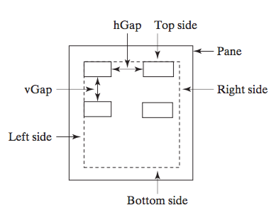

# Java #


## Install ##

先到 [Oracle](http://www.oracle.com/technetwork/java/javase/downloads/index.html) 下載 JDK (Java Development Kit) 不是 JRE (Java Runtime Environment). 有 ME (Micro Edition), SE (Standard Edition) 和 EE (Enterprise Edition) 版本, 選擇 SE 就
可以


### Environmnet ###

`Unix`

	# for sh/bash
	Linux:~ $ export JAVA_HOME=/usr/lib/java
	Linux:~ $ export CLASSPATH=$JAVA_HOME/lib
	Linux:~ $ PATH=$PATH:$JAVA_HOME/bin

	# for csh/tcsh
	Linux:~ $ setenv JAVA_HOME /usr/lib/java
	Linux:~ $ setenv CLASSPATH ${JAVA_HOME}/lib
	Linux:~ $ set path = ( $path ${JAVA_HOME}/bin )


`Windows`

	JAVA_HOME="C:\Program File\Java\jdk"
	CLASSPATH=%JAVA_HOME%\lib
	path=%path;%JAVA_HOME%\bin


### Test ###

安裝完之後, 可寫個 HelloWorld.java 來測試.

	Linux:~ $ cat HelloWorld.java
	public class HelloWorld {
	    public static void main(String[] args) {
	        System.out.println("Hello World!");
	    }
	}

注意, HelloWorld.java 檔名有分大小寫, 且 HelloWorld 除了是檔案名稱 (file name) 之外還是類別名稱 (class name).

	Linux:~ $ javac HelloWorld.java # java 編譯成 class
	Linux:~ $ java HelloWorld # 執行 class

使用 javac, 將 HelloWorld.javac 編譯成 HelloWorld.class, 使用 java 執行 HelloWorld.class


### Compile ###

source         vm             run
      javac            java
.java  --->   .class   --->


`compile java`

	Linux:~ $ javac [-cp classpath] -d [output_dir] src.java # compile, 將 .java 編譯成 .class
	Linux:~ $ java  [-cp classpath] src # run, 執行.class


`generate jar`

	Linux:~ $ jar cf src.jar -C out_dir
	Linux:~ $ jar tf src.jar
	Linux:~ $ jar xf src.jar

### package / module ###

`HelloWithPackage.java`

```Java
package mypackage.mycls;

public class HelloWithPackage {
    public static void sayHello() {
        System.out.println("Hello, Java");
    }

    public static void main(String[] args) {
        sayHello();
    }
}
```

Failed to Run

    Linux:~ $ tree
    .
    └─── HelloWithPackage.java
    Linux:~ $ javac HelloWithPackage.java
    Linux:~ $ tree
    .
    ├── HelloWithPackage.class
    └── HelloWithPackage.java
    Linux:~ $ java HelloWithPackage # error 


Succeful to Run

    Linux:~ $ tree
    .
    └─── HelloWithPackage.java
    Linux:~ $ javac -d . HelloWithPackage.java
    Linux:~ $ tree
    .
    ├── HelloWithPackage.java
    └── mypackage
        └── mycls
            └── HelloWithPackage.class
    Linux:~ $ java mypackage.mycls.HelloWithPackage # success


`Main.class`

```Java
import mypackage.mycls.HelloWithPackage;

public class Main {
    public static void main(String[] args) {
        HelloWithPackage.sayHello();
    }
}
```

Failed to compile

    Linux:~ $ tree
    .
    ├── HelloWithPackage.java
    └── Main.java
    Linux:~ $ javac Main.java # fail to compile


Successful to compile

    Linux:~ $ tree
    .
    ├── HelloWithPackage.java
    └── Main.java
    Linux:~ $ javac -d . HelloWithPackage.java
    Linux:~ $ javac Main.java
    Linux:~ $ tree
    .
    ├── HelloWithPackage.java
    ├── Main.class
    ├── Main.java
    └── mypackage
        └── mycls
            └── HelloWithPackage.class
    Linux:~ $ java Main # success


Successful to compile

    Linux:~ $ tree 
    .
    ├── Main.java
    └── mypackage
        └── mycls
            └── HelloWithPackage.java
    Linux:~ $ javac Main.java
    Linux: ~ $tree 
    .
    ├── Main.class
    ├── Main.java
    └── mypackage
        └── mycls
            ├── HelloWithPackage.class
            └── HelloWithPackage.java
    Linux:~ $ java Main # success


### jar / library ###

除了 source code 之外, 還可以將 class 打包成 jar, 給其他人使用

create jar file

    Linux:~/lib $ tree
    .
    └── HelloWithPackage.class
    Linux:~/lib $ javac -d . HelloWithPackage.java
    Linux:~/lib $ jar cf HelloWithPackage.jar mypackage
    tree
    .
    ├── HelloWithPackage.jar
    ├── HelloWithPackage.java
    └── mypackage
        └── mycls
            └── HelloWithPackage.class
    Linux:~/lib $ rm -rf mypackage HelloWithPackage.java


compile source code

    Linux:~/src $ tree
    .
    └── Main.java
    Linux:~/src $ javac -cp ../lib/HelloWithPackage.jar Main.java
    Linux:~/src $ tree 
    .
    ├── Main.class
    └── Main.java
    Linux:~ $ java -cp ../lib/HelloWithPackage.jar mypackage.mycls.HelloWithPackage Main


改用 環境變數 CLASSPATH 方式編譯

    Linux:~ $ CLASSPATH=../lib/HelloWithPackage.jar javac Main.java
    Linux:~ $ CLASSPATH=../lib/HelloWithPackage.jar java mypackage.mycls.HelloWithPackage Main


un jar file

    Linux:~/lib $ jar xf HelloWithPackage.jar
    Linux:~/lib $ tree 
    .
    ├── HelloWithPackage.jar
    ├── META-INF
    │   └── MANIFEST.MF
    └── mypackage
        └── mycls
            └── HelloWithPackage.class


--------


## Data Type ##


### premitive type ###

| type 		 | object  | default 	 | range 						 |
| ---------- | -------- | --------- | ----------------------------- |
| boolean 	 | Boolean  | false 	 | 								 |
| byte    	 | Byte  | 0 		 | 1 byte  / -2^7 ~ 2^7 - 1 	 |
| char    	 | Character | \u0000 	 | 2 bytes 						 |
| short   	 | Short | 0 		 | 2 bytes / -2^15 ~ 2^15 - 1 	 |
| int     	 | Integer | 0 		 | 4 bytes / -2^31 ~ 2^31 - 1 	 |
| long    	 | Long  | 0L 		 | 8 bytes / -2^63 ~ 2^63 - 1 	 |
| float   	 | Float | 0.0f 	 | 4 bytes / 32 bits 			 |
| double  	 | Double | 0.0.d 	 | 8 bytes / 64 bits 			 |


### autobox ###

`AutoBoxDemo.java`

```Java
public class AutoBoxDemo {
    public static void main(String[] args) {
        int i = 1;
        int j = 2;
        System.out.println("i = " + i);
        System.out.println("i + j = " + i + j); # 出現結果非 i + j = 3, 而是 i + j = 12
        System.out.println("i + j = " + (i + j)); # 出現結果非 i + j = 3
    }
}
```

## Operator ##


### assignment ###

=

### mathematical operator ###

+, -. *, /, %,
+=, -=. *=, /=, %=,

### increment and decrement ###

++, --


### relational operator ###

<, >, <=. >=, ==, !=


### logical operator ###

&&, ||, !
short-circuiting

### bitwise operator ###

&, |, ^

### shift operator ###

<<, >>, >>>, <<=, >>=, >>>=

### literal ###

### exponential notation ###

e

### ternary operator ###

?:

```Java
i < 10 ? 10 * i : 0.1 * i
```

### casting operator ###

()

```Java
4 / 5
(float) 4 / 5
```

## Condition ##

### if else ###

### switch case ###

`SwitchDemo.java`

```Java
public class SwitchDemo {
    public enum PowerStatus {
        POWER_ON, POWER_OFF;

        private int flag;

        PowerStatus(int flag) {
            this.flag = flag;
        }

        public int getFlag() {
            return flag;
        }
    }

    public static void main(String[] args) {
        int value = 1;
        switch (value) {
            case 1:
                System.out.println("Power on");
                break;
            case 0:
                System.out.println("Power off");
                break;
            default:
                System.out.println("Unknown action");
        }

        PowerStatus status = PowerStatus.POWER_OFF;
        switch (status) {
            case POWER_ON:
                System.out.println("Power on");
                break;
            case POWER_OFF:
                System.out.println("Power off");
                break;
            default:
                System.out.println("Unknown action");
        }
        System.out.println("The flag: " + status.getFlag());
    }
}
```

## Loop ##


### for ###

`MultiplicationTable.java`

```Java
public class MultiplicationTable {
    public static void main(String[] args) {
        System.out.println("       Multiplication Table");
        System.out.print("    ");

        for (int j = 1; j <= 9; j++)
            System.out.print("   " + j);
        System.out.println("\n-----------------------------------------");

        for (int i = 1; i <= 9; i++) {
            System.out.print(i + " | ");
            for (int j = 1; j <= 9; j++) {
                System.out.printf("%4d", i * j);
            }
            System.out.println();
        }
    }
}
```

### foreach ###


### while ###

`SentinelValue.java`

```Java
import java.util.Scanner;

public class SentinelValue {
    public static void main(String[] args) {
        Scanner input = new Scanner(System.in);

        System.out.print("Enter an integer (the input ends if it is 0): ");

        int data = input.nextInt();
        int sum = 0;

        while (data != 0) {
            sum += data;
            System.out.print("Enter an integer (the input ends if it is 0): ");
            data = input.nextInt();
        }
        System.out.println("The sum is " + sum);
    }
}
```

    Linux:~ $ javac SentinelValue.java
    Linux:~ $ echo "1 2 3 4 0" > test.txt
    Linux:~ $ java SentinelValue < test.txt # 使用檔案做輸入


### do - while ###

`TestDoWhile.java`

```Java
import java.util.Scanner;

public class TestDoWhile {
    public static void main(String[] args) {
        int data;
        int sum = 0;

        Scanner input = new Scanner(System.in);

        do {
            System.out.print("Enter an integer (the input ends if it is 0): ");
            data = input.nextInt();
            sum += data;
        } while (data != 0);

        System.out.println("The sum is " + sum);
    }
}
```

## Method ##

### static ###

### final ###

## Class ##

## Inheritance ##

### Abstract ###

`GeometricObject.java`

```Java
public abstract class GeometricObject {
    private String color = "white";
    private boolean filled;
    private java.util.Date dateCreated;

    public GeometricObject() {
        dateCreated = new java.util.Date();
    }

    protected GeometricObject(String color, boolean filled) {
        dateCreated = new java.util.Date();
        this.color = color;
        this.filled = filled;
    }

    public String getColor() { return color; }
    public void setColor(String color) { this.color = color; }
    public boolean isFilled() { return filled; }
    public void setFilled(boolean filled) { this.filled = filled; }
    public java.util.Date getDateCreated() { return dateCreated; }

    @Override
    public String toString() { return "created on " + dateCreated + "\ncolor: " + color + " and filled: " + filled; }

    public abstract double getArea();
    public abstract double getPerimeter();
}
```

`Circle.java`

```Java
public class Circle extends GeometricObject {
    private double radius;

    public Circle(double radius) { this.radius = radius; }
    public Circle(double radius, String color, boolean filled) {
        this.radius = radius;
        setColor(color);
        setFilled(filled);
    }

    public double getRadius() { return radius; }
    public void setRadius(double radius) { this.radius = radius; }
    public double getDiameter() { return 2 * radius; }
    public void printCircle() { System.out.println("The circle is created " + getDateCreated() + " and the radius is " + radius); }
    public double getPerimeter() { return 2 * radius * Math.PI; }
    public double getArea() { return radius * radius * Math.PI; }
}
```

`Rectangle.java`

```Java
public class Rectangle extends GeometricObject{
    private double width;
    private double height;

    public Rectangle(double width, double height) {
        this.width = width;
        this.height = height;
    }

    public Rectangle(double width, double height, String color, boolean filled) {
        this.width = width;
        this.height = height;
        setColor(color);
        setFilled(filled);
    }

    public double getWidth() { return  width; }
    public void setWidth(double width) { this.width = width; }
    public double getHeight() { return  height; }
    public void setHeight() { this.height = height; }

    public double getArea() { return width * height; }
    public double getPerimeter() { return 2 * (width + height); }
}
```

`TestGeometricObject.java`

```Java
public abstract class TestGeometricObject {
    public static void main(String[] args) {
        GeometricObject geoObject1 = new Circle(5);
        GeometricObject geoObject2 = new Rectangle(5, 3);

        System.out.println("The two objects have the same area? " + equalArea(geoObject1, geoObject2));

        displayGeometricObject(geoObject1);
        displayGeometricObject(geoObject2);
    }

    public static boolean equalArea(GeometricObject object1, GeometricObject object2) {
        return object1.getArea() == object2.getArea();
    }

    public static void displayGeometricObject(GeometricObject object) {
        System.out.println();
        System.out.println("The area is " + object.getArea());
        System.out.println("The perimeter is " + object.getPerimeter());
    }
}
```

### Interface ###

`TestEdible`

```Java
public class TestEdible {
    public static void main(String[] args) {
        Object[] objects = {new Tiger(2), new Chicken(1), new Apple()};

        for (int i = 0; i < objects.length; i++) {
            if (objects[i] instanceof Edible)
                System.out.println(((Edible) objects[i]).howToEat());
            if (objects[i] instanceof Animal) {
                System.out.println(((Animal) objects[i]).sound());
            }
        }
    }
}


interface Edible {
    String howToEat();
}

abstract class Animal {
    public abstract String sound();
}

class Chicken extends Animal implements Edible {
    @Override
    public String sound() {
        return "Chicken: cock-a-doodle-doo";
    }

    @Override
    public String howToEat() {
        return "Chicken: Fry it";
    }
}

class Tiger extends Animal {
    @Override
    public String sound() {
        return "Tiger: RROOAARR";
    }
}

abstract class Fruit implements Edible {
}

class Apple extends Fruit {
    @Override
    public String howToEat() {
        return "Apple: Make apple cider";
    }
}

class Orange extends Fruit {
    @Override
    public String howToEat() {
        return "Orange: Make orange juice";
    }
}
```

## Exception ##

## Generics ##

## Container ##

### Array ###

### List ###

### Set ###

### Map ###

--------


## String ##

## File I/O ##

## Command ##

## thread / process ##

## reflection ##

## anatation ##


--------


## JavaFX ##

`ShowFlowPane.java`

```Java
import javafx.application.Application;
import javafx.geometry.Insets;
import javafx.scene.Scene;
import javafx.scene.control.Label;
import javafx.scene.control.TextField;
import javafx.scene.layout.FlowPane;
import javafx.stage.Stage;

public class ShowFlowPane extends Application{
    @Override
    public void start(Stage primaryStage) throws Exception {
        FlowPane pane = new FlowPane();
        pane.setPadding(new Insets(11, 12, 13, 14));
        pane.setHgap(5);
        pane.setVgap(5);

        pane.getChildren().addAll(new Label("First Name:"), new TextField(), new Label("MI:"));
        TextField tfMi = new TextField();
        tfMi.setPrefColumnCount(1);
        pane.getChildren().addAll(tfMi, new Label("Last Name:"), new TextField());

        Scene scene = new Scene(pane, 200, 250);
        primaryStage.setTitle("ShowFlowPane");
        primaryStage.setScene(scene);
        primaryStage.show();
    }
}
```


Insets method 的 border sizes 分別為 top (11), right (12), bottom (13), 和 left (14) (單位: pixels)



## Serverlet ##
