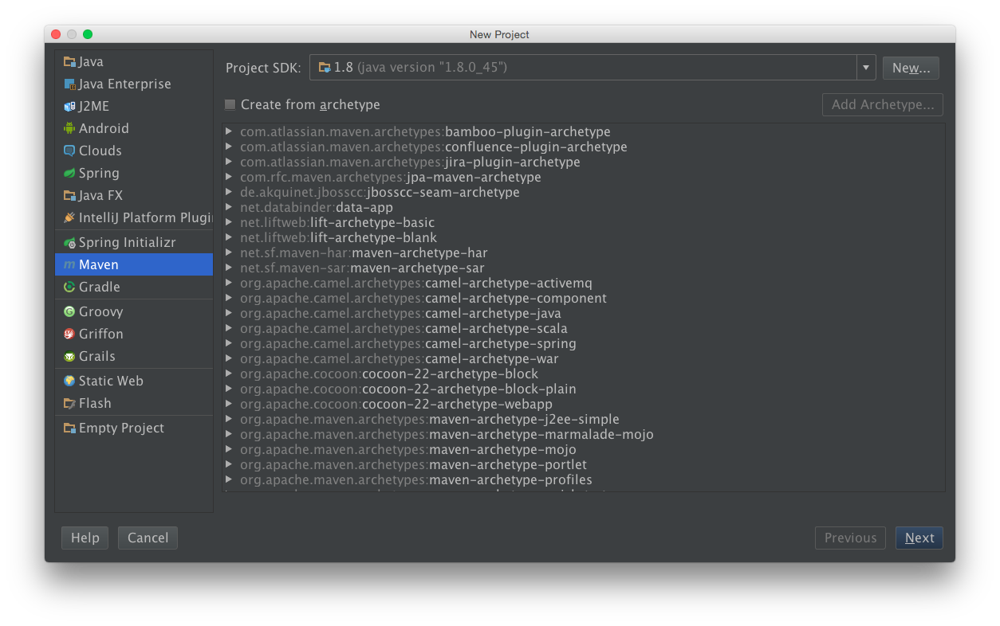
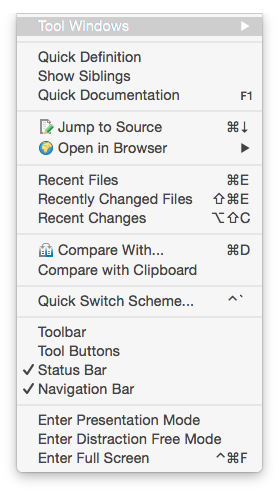
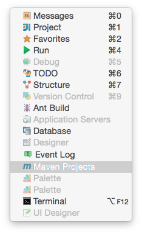
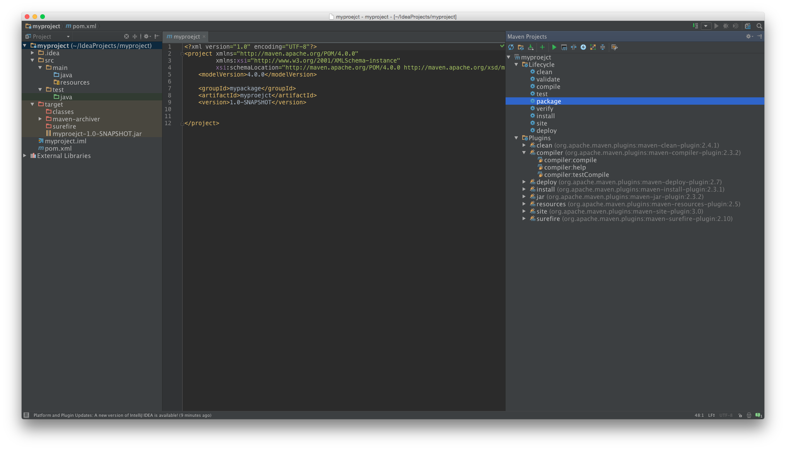

# Maven

Maven 的是 project management tool, 包含 POM (Project Object Model), set of standards, project lifecycle, dependency management system

Convention Over Configuration

Dependency Management

Remote Repositories

Universal Reuse of Build Logic

Tool Portability / Integration

Easy Searching and Filtering of Project Artifacts

## Install

	rhel:~ # wget http://ftp.tc.edu.tw/pub/Apache/maven/maven-3/3.3.9/binaries/apache-maven-3.3.9-bin.tar.gz
	rhel:~ # tar zxf apache-maven-3.3.9-bin.tar.gz -C /opt
	rhel:~ # ln -s /opt/apache-maven-3.3.9 /opt/apache-maven

	rhel:~ # export MAVEN_HOME=/opt/apache-maven
	rhel:~ # export PATH=$PATH:$MAVEN_HOME/bin

	rhel:~ # echo $JAVA_HOME
	rhel:~ # mvn -v

	rhel:~ # export MAVEN_OPTS="-Xms512m"

maven 預設個人目錄為 $basedir/.m2 (預設 $basedir 為使用者家目錄下)

$basedir/.m2/settings.xml 是設定檔;

$basedir/.m2/repository 是存放 jar

## Basic

### Compile & Run Java

在指令模式下編譯執行 java 範例

主程式

	rhel:~ # cat mypackage/Hello.java
	package mypackage;

	import org.apache.log4j.Logger;

	public class Hello {
	    static Logger logger = Logger.getLogger(Hello.class);

	    public static void main(String[] args) {
	        String h = new Hello().say();
	        if (logger.isDebugEnabled())
	            logger.debug("This is debug : " + h);
	        if (logger.isInfoEnabled())
	            logger.info("This is info : " + h);
	        logger.warn("This is warn : " + h);
	        logger.error("This is error : " + h);
	        logger.fatal("This is fatal : " + h);
	    }

	    String say() {
	        return "Hello Maven";
	    }
	}

Log4J 設定檔

	rhel:~ # cat log4j.properties
	# Define the root logger with appender file
	log = /root/log4j
	log4j.rootLogger = DEBUG, FILE

	# Define the file appender
	log4j.appender.FILE=org.apache.log4j.FileAppender
	log4j.appender.FILE.File=${log}/log.out

	# Define the layout for file appender
	log4j.appender.FILE.layout=org.apache.log4j.PatternLayout
	log4j.appender.FILE.layout.conversionPattern=%m%n

編譯 java

	rhel:~ # javac -cp log4j-1.2.12.jar mypackage/Hello.java

建立 jar

	rhel:~ # jar cf mypackage.jar mypackage/mypackage

執行程式

	rhel:~ # java -cp log4j-1.2.12.jar:mypackage.jar -Dlog4j.configuration=file:///root/log4j.properties

查看結果

	rhel:~ # cat /root/log4j/log.out

### JUnit Test Case

使用 JUnit 寫測試, 並編譯測試

測試碼

	rhel:~ # cat TestHello.java
	import mypackage.Hello;

	import org.junit.Test;
	import static org.junit.Assert.assertEquals;

	public class TestHello {
	    @Test
	    public void test_hello() {
	        assertEquals("Hello Maven", new Hello().say());
	    }
	}

編譯 java

	rhel:~ # javac -cp ~/junit-4.10.jar:mypackage.jar TestHello.java

執行測試

	rhel:~ # java -cp ~/junit-4.10.jar:mypackage.jar:. org.junit.runner.JUnitCore TestHello

另一種方式, 將 test case 放在同一層 package 裡

測試碼

	rhel:~ # cat mypackage/HelloTest.java
	package mypackage;

	import org.junit.Test;
	import static org.junit.Assert.assertEquals;

	public class HelloTest {
	    @Test
	    public void test_hello() {
	        assertEquals("Hello Maven", new Hello().say());
	    }
	}

編譯 java

	rhel:~ # jar cf mypackage.jar mypackage

建立 jar

	rhel:~ # javac -cp ~/junit-4.10.jar:mypackage.jar mypackage/HelloTest.java

執行測試

	rhel:~ # java -cp ~/junit-4.10.jar:mypackage.jar org.junit.runner.JUnitCore mypackage/HelloTest

### Maven Build Project

pom.xml 是 Maven 的配置檔, 相當是 Make 裡的 Makefile, ANT 裡的 build.xml

	rhel:~ # mkdir -p project/src/{main,test}/java/mypackage
	rhel:~ # mkdir -p project/src/main/java/resources

加入 java code

	rhel:~ # cp mypackage/Hello.java project/src/main/java/mypackage

加入 unit test case

	rhel:~/project # cp mypackage/HelloTest.java project/src/test/java/mypackage

加入 config file

	rhel:~/project # cp log4j.properties project/src/test/java/resources

設定 pom.xml

	rhel:~/project # cat pom.xml
	<project xmlns="http://maven.apache.org/POM/4.0.0" xmlns:xsi="http://www.w3.org/2001/XMLSchema-instance"
	  xsi:schemaLocation="http://maven.apache.org/POM/4.0.0 http://maven.apache.org/maven-v4_0_0.xsd">
	  <modelVersion>4.0.0</modelVersion>
	  <groupId>mypackage</groupId>
	  <artifactId>project</artifactId>
	  <packaging>jar</packaging>
	  <version>1.0-SNAPSHOT</version>

	  <name>Hello Project</name>
	  <url>http://hello.com</url>

	  <dependencies>
	    <dependency>
	      <groupId>log4j</groupId>
	      <artifactId>log4j</artifactId>
	      <version>1.2.12</version>
	    </dependency>

	    <dependency>
	      <groupId>junit</groupId>
	      <artifactId>junit</artifactId>
	      <version>4.10</version>
	      <scope>test</scope>
	    </dependency>
	  </dependencies>
	</project>

modleVersion: 指定 pom.xml 適用的版本; maven 2.x, 3 以上需用 4.0

groupId: project's group ID

artifactId: project ID

packaging: 打包格式, 不寫預設為 jar

version: project version

maven coordinate 指的就是 maven 裡面的套件的唯一名稱, 這由 groupId, artifactId, packaging 和 version 組成. 主要功能是定位套件在 maven repository 的唯一名稱

name: 名稱

url: 

name 和 url 只是描述性的說明

dependencies, dependency 設定需要 jar

groupId, artifactId, version 同之前

scope 在哪層目錄下, 不指定會被包含在 main, (因為 junit 只做 unit test, 不需要被包含在主程式中)

	rhel~: # tree project
	project
	├── pom.xml
	└── src
	    ├── main
	    │   └── java
	    │       ├── mypackage
	    │       │   └── Hello.java
	    │       └── resources
	    │           └── log4j.properties
	    └── test
	        └── java
	            └── mypackage
	                └── HelloTest.java

	rhel:~/project # mvn compile          # 編譯 src/main/java 底下的 java file, 並將 class 產生在 target 目錄 (不考慮 test)

	rhel:~/project # mvn clean            # 清除

	rhel:~/project # mvn test             # 編譯 src/{main,test}/java 底下的 java file, 並作測試
	rhel:~/project # mvn test -Dmaven.test.failure.ignore=true

	rhel:~/project # mvn package          # src/{main,test}/java 底下的 java file 打包成 jar, 並產生在 target 目錄

	rhel:~/project # mvn install          # package 被打包成 jar 安裝在  $basedir/.m2/repository
	rhel:~/project # mvn install -DskipTests
	rhel:~/project # mvn install -DskipITs
	rhel:~/project # mvn install -Dmaven.test.skip=true

	rhel:~/project # mvn exec:java -Dexec.mainClass=mypackage.DemoLog4J

## IDE

### IntelliJ IDEA

`新建 Maven Project`

`IntelliJ IDEA 設定`

開啟 project 後, 到 Menu | View | Tools Windows

可見到下圖, 右側部分就是跟 Maven 相關操作, 可在上面直接點選操作

## Quick Start

### Create Project

batch mode 方式 create project

	rhel:~ # mvn archetype:generate \
	> -DgroupId=com.mycompany.app \
	> -DartifactId=myproject \
	> -DinteractiveMode=false

groupId 和 artifactId 套件資訊會寫入到 pom.xml 

interactive mode 方式 create project

	rhel:~ # mvn archetype:generate                       # create project
	rhel:~ # mvn help:describe -Dplugin=archetype -Dfull  # help document
	rhel:~ # mvn help:effective-pom                       # current pom setting
	rhel:~ # mvn dependency:resolve                       # project dependency
	rhel:~ # mvn dependency:tree -Dscope=compile          # project dependency

maven 執行上 plugin 和 goal. 以 `mvn archetype:generate` 指令來說, archetype 就是 plugin, 而 generate 就是 goal. 語法就可表示為 `mvn <pluginId>:<goalId>`. -D 則是傳入參數

### Folder Structure

	rhel:~ # tree myproject/
	my-app/
	|-- pom.xml
	`-- src
	    |-- main
	    |   `-- java
	    |       `-- com
	    |           `-- mycompany
	    |               `-- app
	    |                   `-- App.java
	    `-- test
	        `-- java
	            `-- com
	                `-- mycompany
	                    `-- app
	                        `-- AppTest.java
	rhel:~ # cat my-app/src/main/java/com/mycompany/app/App.java

src/main/java        放置專案原始碼

src/test/java        放置單元測試用原始碼

src/main/resources   放置設定檔, 例如 log4j.properties

src/test/resources   放置測試用設定檔, 如同測試程式本身不會被打包進 jar

target               distributable JAR

target/classes       complied byte code

### Build Project

	rhel:~/myproject $ mvn compile
	rhel:~/myproject $ mvn package
	rhel:~/myproject $ java -cp target/my-app-1.0-SNAPSHOT.jar com.mycompany.app.App

maven lifecycle 常用的三種, 分別是 default, clean, site. META-INF/plexus/components.xml

default:

clean: cleans up artifacts created by prior builds

site: generates site documentation for this project

## Plugin

	mvn help:describe -Dplugin=help [-Dfull]   # 顯示 plugin-help 訊息
	mvn help:describe -Dplugin=compiler -Dmojo=compile -Dfull

## Command

	mvn help:effective-pom
	rhel:~ # mvn -h
	rhel:~ # mvn help system
	rhel:~ # mvn complie
	rhel:~ # mvn package
	rhel:~ # mvn clean
	rhel~: # mvn site

validate: validate the project is correct and all necessary information is available
compile: compile the source code of the project
test: test the compiled source code using a suitable unit testing framework. These tests should not require the code be packaged or deployed
package: take the compiled code and package it in its distributable format, such as a JAR.
integration-test: process and deploy the package if necessary into an environment where integration tests can be run
verify: run any checks to verify the package is valid and meets quality criteria
install: install the package into the local repository, for use as a dependency in other projects locally
deploy: done in an integration or release environment, copies the final package to the remote repository for sharing with other developers and projects.

help:active-profiles lists the profiles which are currently active for the build.
help:all-profiles lists the available profiles under the current project.
help:describe describes the attributes of a Plugin and/or a Mojo (Maven plain Old Java Object).
help:effective-pom displays the effective POM as an XML for the current build, with the active profiles factored in.
help:effective-settings displays the calculated settings as an XML for the project, given any profile enhancement and the inheritance of the global settings into the user-level settings.
help:evaluate evaluates Maven expressions given by the user in an interactive mode.
help:expressions displays the supported Plugin expressions used by Maven.
help:system displays a list of the platform details like system properties and environment variables.