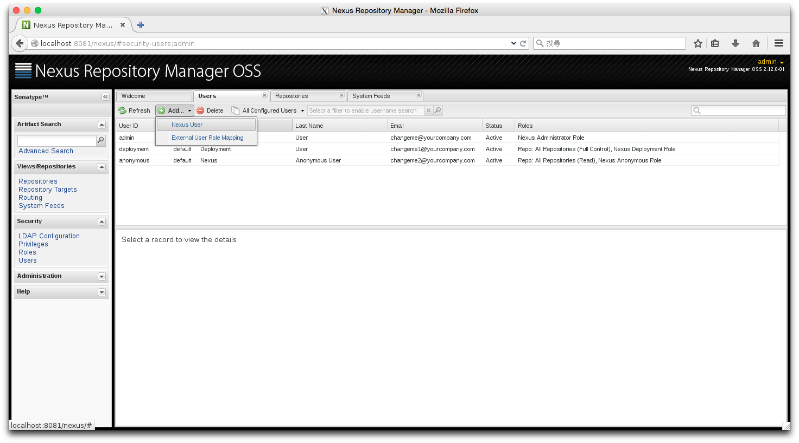
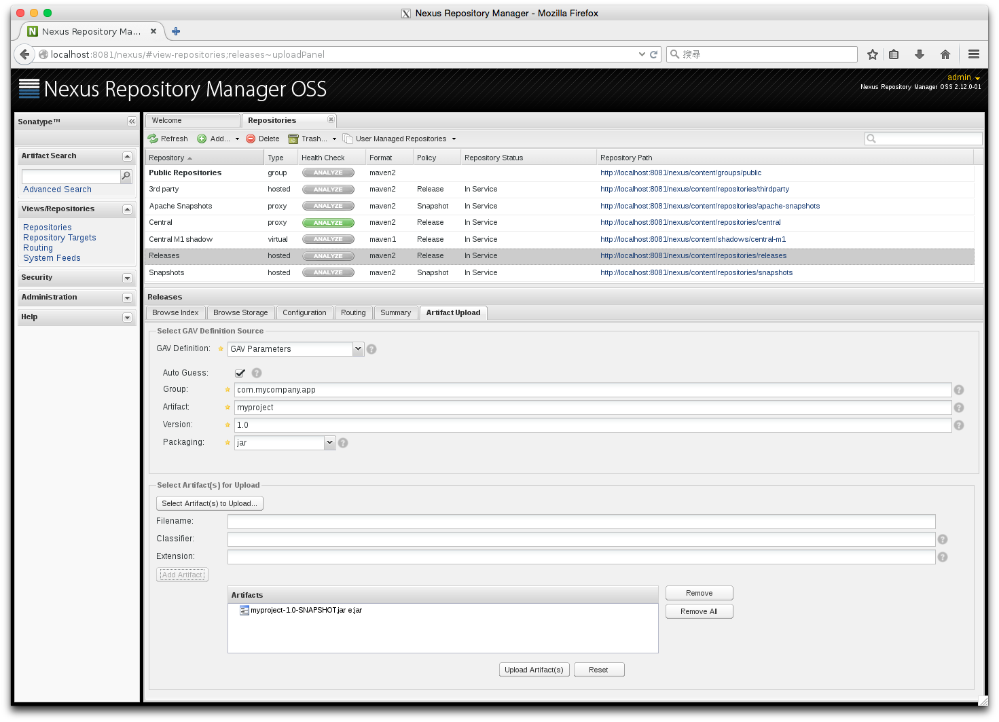
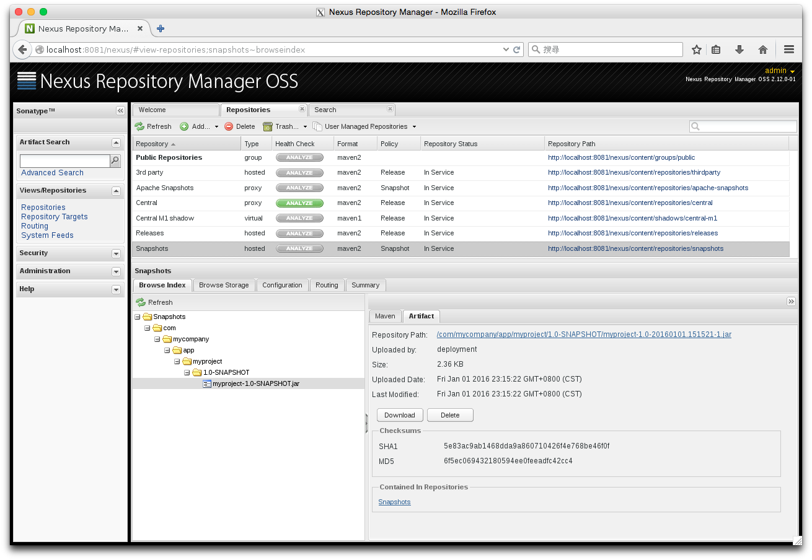
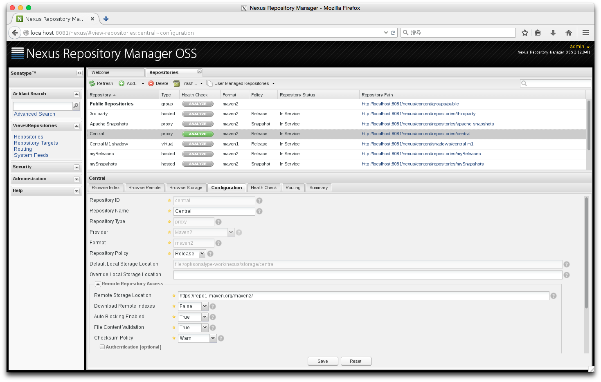

# Nexus Repository Management

Nexus 是 Sonatype 的提供的管理 jar 的 Repository Manager.

## Install

Step 1. 關閉防火牆

	rhel:~ # firewall-cmd --zone=public --add-port=8081/tcp --permanent
	rhel:~ # firewall-cmd --zone=public --add-service=http --permanent
	rhel:~ # firewall-cmd --reload
	rhel:~ # firewall-cmd --list-all

Nexus 使用 8081 port

Step 2. 下載

先到 http://www.sonatype.org/nexus/go/ 下載 nexus-2.12.0-01-bundle.tar.gz

	#新增使用者
	rhel:/opt # useradd nexus

	#
	rhel:/opt # tar zxf nexus-2.12.0-01-bundle.tar.gz
	rhel:/opt # ln -s nexus-2.12.0-01 nexus
	rhel:/opt # mkdir -p /opt/sonatype-work
	rhel:/opt # chown -R nexus:nexus /opt/nexus-2.12.0-01
	rhel:/opt # chown -R nexus:nexus /opt/sonatype-work

	# 修改設定
	rhel:/opt # vi /opt/nexus/bin/nexus
	...
	NEXUS_HOME=/opt/nexus
	...
	RUN_AS_USER=nexus
	...

	rhel:~ # /opt/nexus/bin/nexus start            # 啟動
	rhel:~ # /opt/nexus/bin/nexus stop             # 關閉
	rhel:~ # /opt/nexus/bin/nexus console          # 測試

	rhel:~ # tail -f /opt/nexus/logs/wrapper.log   # log file

	rhel:~ # ln -s /opt/nexus/bin/nexus /etc/init.d/nexus

在 browser 上輸入 http://localhost:8081/nexus 可以看到網頁, 預設 Administrator (admin/admin123), Depolyment (depolyment/depolyment123)

## Add User

Step 1. 先在左側點選 Security \ Users, 然後按 Add... \ Nexus User 如下圖所示

Step 2. 在下面欄位輸入帳號密碼等資訊, 主要是 Role Management 選擇管理的 Repository 和 Permission (底下設定是給 depoly 用)

## Deploy Jar (Hosted Reository)

Nexus 設定/操作

Step 1. 先在左側點選 View / Repositores \ Repositores, 然後按 Add... \ Hosted Repository 如下圖所示

Step 2. 在下面欄位輸入帳號密碼等資訊, 因為是新增 Snapshot, 在 Repository Policy 選 Snapshot

Step 3. 在下面欄位輸入帳號密碼等資訊, 因為是新增 Release, 在 Repository Policy 選 Release

Maven 設定/操作

Step 1. 設定 settings.xml

	rhel:~ # cat .m2/setting.xml
	<settings xmlns="http://maven.apache.org/SETTINGS/1.0.0"
	          xmlns:xsi="http://www.w3.org/2001/XMLSchema-instance"
	          xsi:schemaLocation="http://maven.apache.org/SETTINGS/1.0.0
	                              http://maven.apache.org/xsd/settings-1.0.0.xsd">

	  <servers>
	    <server>
	      <id>mySnapshots</id>
	      <username>deployment</username>
	      <password>deployment123</password>
	    </server>
	    <server>
	      <id>myReleases</id>
	      <username>deployment</username>
	      <password>deployment123</password>
	    </server>
	  </servers>

	</settings>

id 是填寫

Step 2. 設定 pom.xml

	rhel:~ # mvn archetype:generate \
	> -DgroupId=com.mycompany.app \
	> -DartifactId=myproject \
	> -DinteractiveMode=false
	rhel:~ # cd myproject

	rhel:~/myproject # cat pom.xml
	<project xmlns="http://maven.apache.org/POM/4.0.0"
	         xmlns:xsi="http://www.w3.org/2001/XMLSchema-instance"
	         xsi:schemaLocation="http://maven.apache.org/POM/4.0.0
	                             http://maven.apache.org/maven-v4_0_0.xsd">
	  <modelVersion>4.0.0</modelVersion>
	  <groupId>com.mycompany.app</groupId>
	  <artifactId>myproject</artifactId>
	  <packaging>jar</packaging>
	  <version>1.0-SNAPSHOT</version>
	  <name>myproject</name>
	  <url>http://maven.apache.org</url>

	  <distributionManagement>
	    <repository>
	      <id>myReleases</id>
	      <url>http://localhost:8081/nexus/content/repositories/myReleases/</url>
	    </repository>
	    <snapshotRepository>
	      <id>mySnapshots</id>
	      <url>http://localhost:8081/nexus/content/repositories/mySnapshots/</url>
	    </snapshotRepository>
	  </distributionManagement>

	  <dependencies>
	    <dependency>
	      <groupId>junit</groupId>
	      <artifactId>junit</artifactId>
	      <version>3.8.1</version>
	      <scope>test</scope>
	    </dependency>
	  </dependencies>
	</project>

Step 3. 執行

	rhel:~/myproject # mvn clean deploy

## Upload Jar

Nexus 設定/操作

Step 1. 直接使用預設 repository

## Delete Jar

Nexus 設定/操作

Step 1. 直接使用預設 repository

## Cache Jar (Proxy Reository)

Nexus 設定/操作

Step 1. 直接使用預設 repository

Maven 設定/操作

之後使用 mvn 有下載任何 jar, central repository 就會下載一份

Method 1. 設定 settings.xml

	rhel:~ # cat .m2/setting.xml
	<settings xmlns="http://maven.apache.org/SETTINGS/1.0.0"
	      xmlns:xsi="http://www.w3.org/2001/XMLSchema-instance"
	      xsi:schemaLocation="http://maven.apache.org/SETTINGS/1.0.0
	                          http://maven.apache.org/xsd/settings-1.0.0.xsd">

	<mirrors>
	  <mirror>
	    <id>Central</id>
	    <mirrorOf>*</mirrorOf>
	    <name>central-mirror</name> 
	    <url>http://localhost:8081/nexus/content/repositories/central/</url>
	  </mirror> 
	</mirrors>

	</settings>

Method 2. 設定 settings.xml

	rhel:~ # cat .m2/setting.xml
	<?xml version="1.0" encoding="UTF-8"?>
	<settings xmlns="http://maven.apache.org/SETTINGS/1.0.0"
	  xmlns:xsi="http://www.w3.org/2001/XMLSchema-instance"
	  xsi:schemaLocation="http://maven.apache.org/SETTINGS/1.0.0
	                      http://maven.apache.org/xsd/settings-1.0.0.xsd">

	<profiles>
	<profile>
	<id>myprofile</id>
	<repositories>
	    <repository>
	      <id>central</id>
	      <name>Central</name>
	      <url>http://localhost:8081/nexus/content/repositories/central</url>
	    </repository>
	</repositories>
	</profile>
	</profiles>

	<activeProfiles>
	   <activeProfile>myprofile</activeProfile>
	</activeProfiles>

	</settings>
