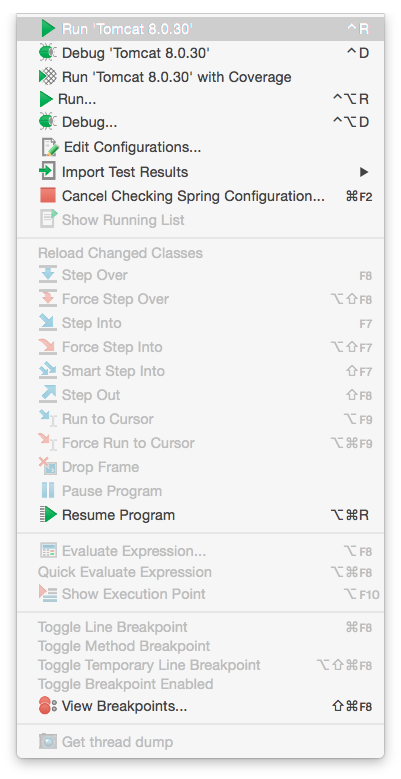
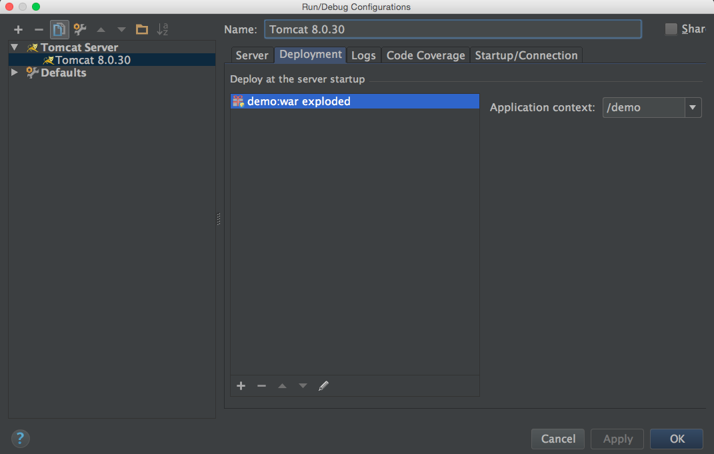

# Tomcat


## Install

到 [Apache Tomcat](http://tomcat.apache.org) 下載解壓縮版的 (zip, tar.gz) tomcat

```
rhel:~ # tar zxf apache-tomcat-8.0.30.tar.gz -C /opt
rhel:~ # ln -s /opt/apache-tomcat-8.0.30 /opt/apache-tomcat
```


## Service

```
rhel:~ # /opt/apache-tomcat/bin/catalina.sh start
rhel:~ # /opt/apache-tomcat/bin/catalina.sh stop

rhel:~ # netstat -lntup | grep 8080
```

用 browser 連 http://localhost:8080/


## Configuration

```
rhel:~ # tree -d -L 1 /opt/apache-tomcat
apache-tomcat
├── bin
├── conf
├── lib
├── logs
├── temp
├── webapps
└── work

# tomcat 設定
rhel:~ # cat /opt/apache-tomcat/conf/server.xml
<?xml version='1.0' encoding='utf-8'?>
<Server port="8005" shutdown="SHUTDOWN">
  <Listener className="org.apache.catalina.startup.VersionLoggerListener" />
  <Listener className="org.apache.catalina.core.JreMemoryLeakPreventionListener" />
  <Listener className="org.apache.catalina.mbeans.GlobalResourcesLifecycleListener" />
  <Listener className="org.apache.catalina.core.ThreadLocalLeakPreventionListener" />
  <GlobalNamingResources>
    <Resource name="UserDatabase" auth="Container"
              type="org.apache.catalina.UserDatabase"
              description="User database that can be updated and saved"
              factory="org.apache.catalina.users.MemoryUserDatabaseFactory"
              pathname="conf/tomcat-users.xml" />
  </GlobalNamingResources>
  <Service name="Catalina">
    <!-- 設定開啟的 port-->
    <Connector port="8080" protocol="HTTP/1.1"
               connectionTimeout="20000"
               redirectPort="8443" />
    <Engine name="Catalina" defaultHost="localhost">
      <Realm className="org.apache.catalina.realm.LockOutRealm">
        <Realm className="org.apache.catalina.realm.UserDatabaseRealm"
               resourceName="UserDatabase"/>
      </Realm>
      <Host name="localhost"  appBase="webapps"
            unpackWARs="true" autoDeploy="true">
        <Valve className="org.apache.catalina.valves.AccessLogValve" directory="logs"
               prefix="localhost_access_log" suffix=".txt"
               pattern="%h %l %u %t &quot;%r&quot; %s %b" />
      </Host>
    </Engine>
  </Service>
</Server>

# webapp 設定
rhel:~ # cat /opt/apache-tomcat/conf/web.xml
<?xml version="1.0" encoding="ISO-8859-1"?>
<web-app xmlns="http://xmlns.jcp.org/xml/ns/javaee"
  xmlns:xsi="http://www.w3.org/2001/XMLSchema-instance"
  xsi:schemaLocation="http://xmlns.jcp.org/xml/ns/javaee
                      http://xmlns.jcp.org/xml/ns/javaee/web-app_3_1.xsd"
  version="3.1">
    <servlet>
        <servlet-name>default</servlet-name>
        <servlet-class>org.apache.catalina.servlets.DefaultServlet</servlet-class>
        <init-param>
            <param-name>debug</param-name>
            <param-value>0</param-value>
        </init-param>
        <!-- 設定顯示 web app 目錄, 開發時建議開啟, 發行時建議關閉 -->
        <init-param>
            <param-name>listings</param-name>
            <param-value>false</param-value>
        </init-param>
        <load-on-startup>1</load-on-startup>
    </servlet>
    <servlet-mapping>
        <servlet-name>default</servlet-name>
        <url-pattern>/</url-pattern>
    </servlet-mapping>
    <mime-mapping>
        <extension>123</extension>
        <mime-type>application/vnd.lotus-1-2-3</mime-type>
    </mime-mapping>
    ...
    <welcome-file-list>
        <welcome-file>index.html</welcome-file>
        <welcome-file>index.htm</welcome-file>
        <welcome-file>index.jsp</welcome-file>
    </welcome-file-list>
</web-app>

# account role 設定
rhel:~ # cat /opt/apache-tomcat/webapps/manager/WEB-INF/web.xml

# account 設定
rhel:~ # cat /opt/apache-tomcat/conf/tomcat-users.xml
<?xml version='1.0' encoding='utf-8'?>
<tomcat-users xmlns="http://tomcat.apache.org/xml"
              xmlns:xsi="http://www.w3.org/2001/XMLSchema-instance"
              xsi:schemaLocation="http://tomcat.apache.org/xml tomcat-users.xsd"
              version="1.0">
  <!-- 新增使用者 -->
  <user username="tomcat" password="tomcat" roles="manager-gui"/>
</tomcat-users>
```

### webapp

新增一個 web app

```
# method 1. 在 conf/Catalina/localhost/.xml 設定 web app 路徑
rhel:~ # cat /opt/apache-tomcat/conf/Catalina/localhost/xxx.xml

# method 2. 直接在 webapps 開發 Java JSP/Serverlet
rhel:~ # cp -r myapp/ /opt/apache-tomcat/webapps/
```

## IDE

### IntelliJ IDEA


`新建 Java EE Project`


`IntelliJ IDEA 設定`




