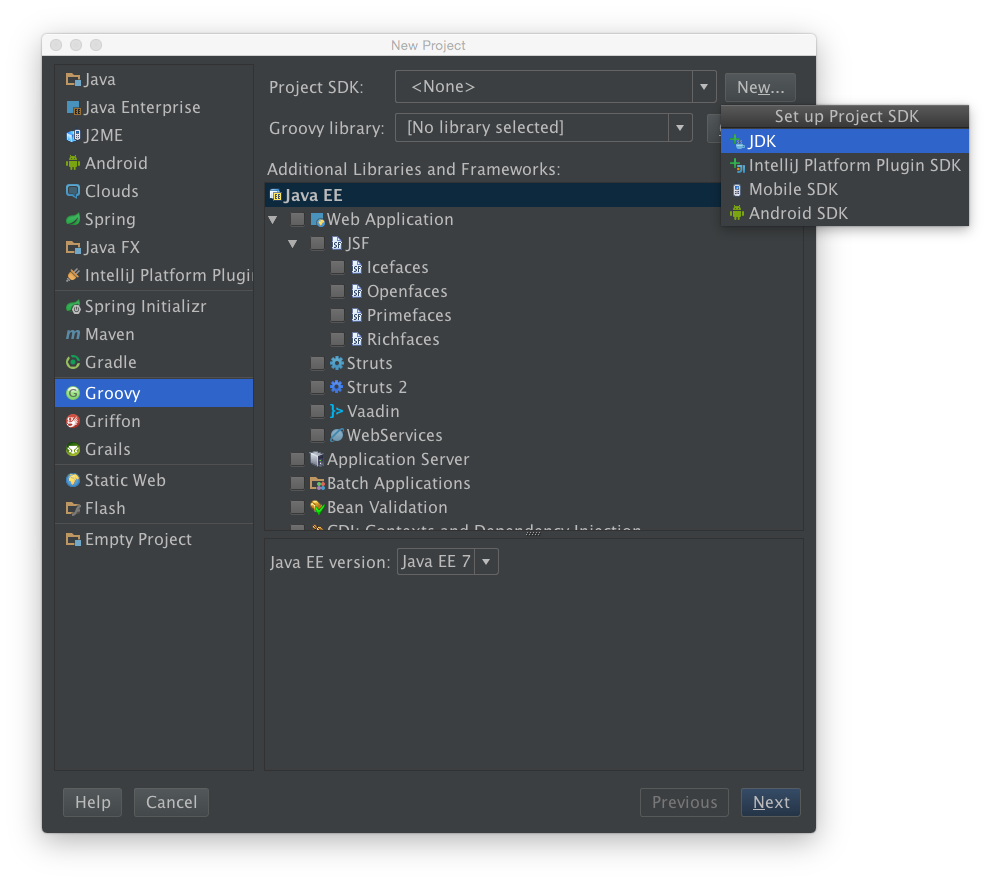
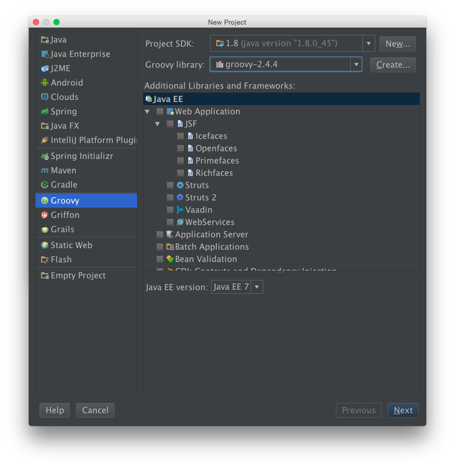
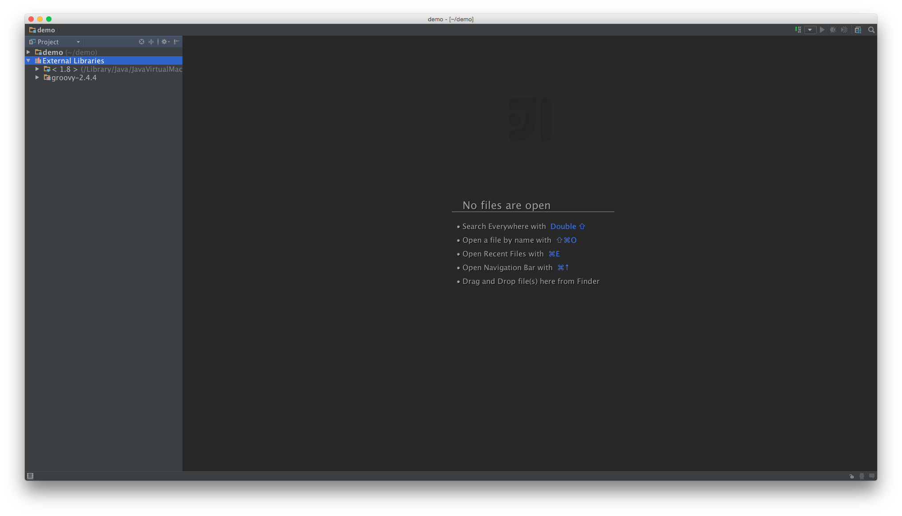
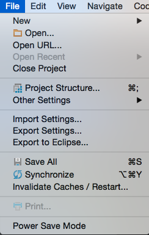
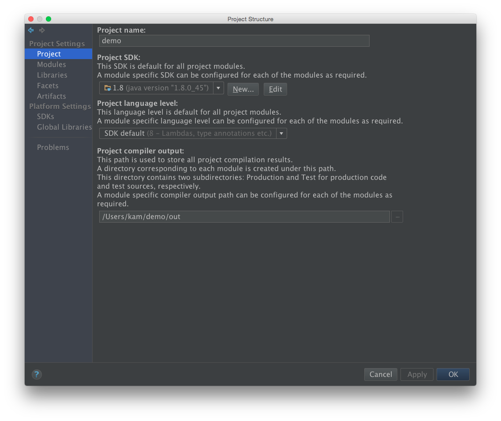
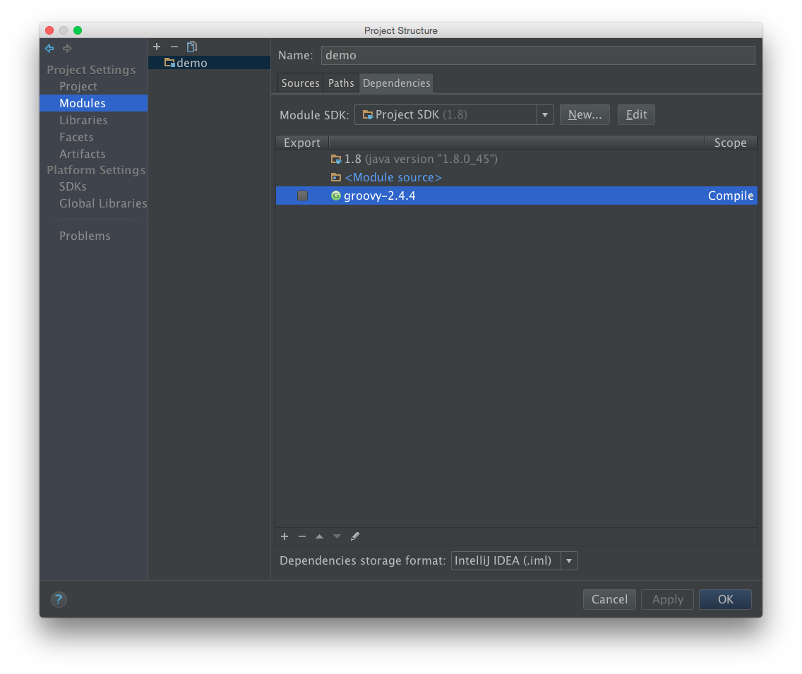
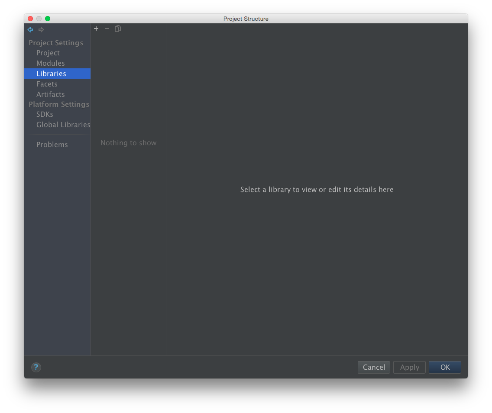

# 簡介


  Groovy 在 2003 年問世, Apache Software Foundation 的軟體工程師 James Strachan 創造, 目前專案的負責人是 Guillaume LaForge. Groovy 是自由軟體, 採用 Apache 2.0 開放原始碼授權, 第一個正式版本 1.0 在 2007 發佈, 2012 年發佈 2.0 版本後.

  Groovy 語法大致上和 Java 語言相似; 卻比 Java 更容易學習與使用, 比更適合剛入門學習寫程式的初學者. 已熟悉 Java 的開發者, 很快就能學會使用 Groovy 寫程式. 


----


# 安裝

Groovy 可以使用 RPM, DPKG 等系統內建套件直接安裝, 但 Linux, MacOSX, FreeBSD 建議使用 SDKMAN (Software Development Kit MANager), 前身為 GVM (Groovy enVironment Manager) 安裝管理. 因為 Groovy 會使用到 Java, 須先安裝 JDK 6+ (Java Development Kit), 建議 JDK 8+. 使用 SDKMAN 安裝 end user 即可, 不需要 admin.

```bash
# install jdk, 這裏使用安裝 openjdk 
linux:~ # yum install -y java-1.8.0-openjdk-devel
linux:~ # echo $JAVA_HOME            # 確認 Java 環境變數
```

在安裝 sdk 之後, 會在寫入 $HOME/.bashrc $HOME/.bash_profile, $HOME/.zshrc 加入環境設定. 而 sdkman 套件安裝在 $HOME/.sdkman 底下

```bash
# install sdk
linux:~ $ curl -s get.sdkman.io | bash
linux:~ $ cat ~/.bashrc
source "$HOME/.sdkman/bin/sdkman-init.sh"

# install groovy
linux:~ $ sdk list
linux:~ $ sdk install groovy
linux:~ $ echo $GROOVY_HOME         # 確認 Groovy 環境變數
```

----


# 使用環境


## command mode / 指令模式

```bash
linux:~ $ groovy -e "println 'Hi, Groovy'"
```


## script mode / 指令稿模式

```bash
linux:~ $ cat hi.groovy
println 'Hi, Groovy'
linux:~ $ groovy hi.groovy
```


## inactive mode / 互動模式

```bash
linux:~ $ export EDITOR=vim
linux:~ $ groovysh
groovy> println 'Hi, Groovy'       // 輸入指令方式執行
groovy> :load hi.groovy            // 載入檔案方式執行

groovy> :edit                      // 使用編輯方式
def abc() {
    println "abc"
}
groovy> abc

groovy> :show all                  // 顯示已設定 variable, class, import

groovy> [].getClass()              // 回傳 class java.util.ArrayList
groovy> :doc java.util.ArrayList   // 查詢 java.util.ArrayList doc
```


# 編譯


## Groovy Script

```bash
linux:~ $ cat hi.groovy 
println 'Hi, Groovy'

linux:~ $ groovy hi.groovy       # 使用 Groovy 執行
linux:~ $ groovyc Main.groovy    # 編譯成 ByteCode
linux:~ $ ls
hi.class    hi.groovy

linux:~ # java -cp $GROOVY_HOME/embeddable/groovy-all-2.4.4.jar:. Hi   # 使用 Java 執行, 因為有 ByteCode
```


## Groovy Script Load Groovy Class

```bash
linux:~ $ cat myclass/GroovyCar.groovy 
package myclass

class GroovyCar {
    int year = 2000
    int miles

    String toString() {
        "year: ${year}, miles: ${miles}"
    }
}

linux:~ $ cat runGroovyCar.groovy 
import myclass.GroovyCar

println new GroovyCar()

linux:~ $ groovy runGroovyCar.groovy

linux:~ $ groovyc myclass/GroovyCar.groovy     # 編譯成 ByteCode
linux:~ $ groovyc runGroovyCar.groovy

linux:~ $ java -cp $GROOVY_HOME/embeddable/groovy-all-2.4.4.jar:. runGroovyCar
```


## Groovy Script Load Java Class

```bash
linux:~ $ cat myclass/JavaCar.java 
package myclass;

public class JavaCar {
    public JavaCar() {
        System.out.println("Create Java Car");
    }

linux:~ $ cat runJavaCar.groovy 
import myclass.JavaCar

new JavaCar()

linux:~ $ javac myclass/JavaCar.java     # 編譯成 ByteCode

linux:~ $ groovy runJavaCar.groovy       # 沒將 java 編譯成 ByteCode, Groovy 無法 load class

linux:~ $ groovyc runJavaCar.groovy
linux:~ $ java -cp $GROOVY_HOME/embeddable/groovy-all-2.4.4.jar:. runJavaCar
```


## Java Source Load Groovy Class

```bash
linux:~ $ cat myclass/ClosureClass.groovy 
package myclass

class ClosureClass {
    def passToClosure(int value, closure) {
        println "pass ${value} to closure"
        closure(value)
    }
}

linux:~ $ cat ExeGroovyClosure.java 
import myclass.ClosureClass;

public class ExeGroovyClosure {
    public static void main(String[] args) {
        ClosureClass o = new ClosureClass();
        o.passToClosure(2, new Object() {
            public void call(int value) {
                System.out.println("Java closure");
            }
        });
    }
}

linux:~ $ groovyc myclass/ClosureClass.groovy
linux:~ $ javac -cp $GROOVY_HOME/embeddable/groovy-all-2.4.4.jar:. ExeGroovyClosure.java
linux:~ $ java -cp $GROOVY_HOME/embeddable/groovy-all-2.4.4.jar:. ExeGroovyClosure
```

## Groovy Script Call Groovy Script

## Java Source Call Groovy Script

----


# IDE


## IntelliJ IDEA 設定

1. 建立新專案

  

2. 設定 JDK 和 Groovy Library

  

  2.1 設定 JDK

  

  預設 JDK 路徑為 $JAVA_HOME

  2.2 完成後可看到 Project SDK 有套用剛剛設定

  

  2.3 同樣的方式設定 Groovy library (因為這裡是寫 Groovy Project)

  

  預設 library 路徑為 $GROOVY_HOME

3. 設定專案名稱

  

4. 開始寫程式

  

  注意, External Library 處表示此專案執行時會用到 Library

5. 修改 External Library 設定 (若有需要)

  到 File \ Project Structure 開啟

  

  5.1 Project 設定 Project name 和 Project SDK

  

  5.2 Modules

  

  5.3 Labraries (For the project)

  

  5.4 SDKs 設定可用 SDK

  

  5.5 Global Labraries (For all project)


# 資料型態

groovy 像一般 script language 一樣是 dynamic type, 使用時不需要先定義形別. 也可像 Java 一樣, 使用前先定義資料型態 (支援 Java 所定義的資料型態). def 

## Number / 數值

```groovy
i = 10
int j = 20
Integer k = 30
def l = 40
```

## String / 字串

一般字串放在 ' (單引號) 或 "(雙引號), 中間. ' 內的所有字元, 皆無特殊意義; " 內的字元, 有些會有特需意義, 例如 \n 是換行, ...

```groovy
// single line string
println "don't say \"no\""

println 'don\'t say "no"'

// multiple line string
println """foo
bar"""

println '''foo
bar'''

// string interpolation
println "1 + 1 = ${1 + 1}"

var = 10
println "var = ${var}"

// string concatenation
println "Hi, " + "Groovy"
```


Regular Expression / 正規表示

## ArrayList /

arraylist 像是其他一般語言的陣列 (array), index 從 0 開始, 和陣列不一樣的, arraylist 不需要宣告型別, arraylist 可裝任何型別. arraylist 在 assign value 時, 是 copy by reference 而非 copy by value

```groovy
// assign value
list1 = []                   // empty arraylist
println("list1: " + list1 + ", list1 type: " + list1.getClass())
list1 = ["ABC", 'xyz', 123]

list1 = ["ABC", 'xyz', 123]
list2 = list1                // call by reference
list3 = list1[0..-1]         // call by value

println "list1: " + list1
println "list2: " + list2
println "list3: " + list3


// operation
list1.remove(0)              // remove element
println "list1: " + list1
println "list2: " + list2
println "list3: " + list3
list1.add('Last')            // append element
list1 << 'Last'              // append element
list1.add(0, 'First')        // insert element
println list1.sort()         // sort arraylist
println list1.reverse()      // reverser arraylist


// condition
println 'xyz' in list1
println list1.empty


// loop
for (i = 0; i < list1.size(); i++)
    println "${list1[i]}"

for (e in list1)
    println("${e}")


// closure 用法
list1.each { e ->
    println (e)
}

list1.each {                // it 為預設 iterator
    println "${it}"
}


// ArrayList and String
println ['abc', 'XYZ', '123'].join(", ")  // ArrayList to String
println "abc,XYZ,123".split(',')          // String to ArrayList
```

## HashMap /

hashmap 像是其他一般語言的關聯式陣列 (associative array),

```
// assign value
hash1 = [:]
println("hash1: " + hash1 + ", hash1 type: " + hash1.getClass())

hash1 = ['A': 'ABC', "x": "xyz", "0": 123]
hash2 = hash1               // call by reference


// operation
hash1.put('Sun', "Sunday")  // add element
hash1['Mon'] = 'Monday'     // 同上
hash1.Tues = 'Tuesday'      // 同上
hast1.remove(A)             // delete element
println "hash1" + hash1
println hash2
println hash1.keySet()      // 顯示 all key
println hash1.values()      // 顯示 all value
println hash1['Sun']        // 顯示該 key value 
println hash1.Sun           // 同上


// condition
println hash1.containsKey('xyz')
println hash1.containsValue('xyz')
println hash1.isEmpty()


// loop
for (e in hash1)
    println "${e.key}: ${e.value}"


// closure 用法
hash1.each { k, v ->
    println("$k: $v")
}

hash1.each {           // it 為預設 iterator
    println "${it.key}: ${it.value}"
}
```

----


# 控制流程


## if-else

```
// if-else 範例
if (System.properties['os.name'] == 'Linux')
    os = 'Linux'
else
    os = 'Unknown'
println os

// if-eles 改用 ternary
os = (System.properties['os.name'] == 'Linux') ? 'Linux' : 'Unknown'
println "OS: $os"

// if-else
print 'input sex [m/f]: '
sex = System.in.newReader().readLine();

if (sex == 'm')
    println 'Male'
else if (sex == 'f')
    println 'Female'
else
    println 'Unknown'
```


## ternary

```groovy
def data = null
// def data = "value"
def var = "empty"


if (data != null) {
  var = data
}
println var


var = data != null ? data : "empty"
println var


var = data ?: "empty"
println var
```


## switch

```
// switch
print 'input sex [m/f]: '
sex = System.in.newReader().readLine();

switch (sex) {
    case "m":
        println 'Male'
        break
    case "f":
        println 'Female'
        break
    default:
        println 'Unknown'
        break
}
```


## for / while

`for number`

```
for (i = 0; i < 10; i++)
    println "i = $i"

for (i in 0..9)
    println "i = $i"

i = 0
while (i < 10) {
    println "i = ${i}"
    i++
}

0.upto(9) {
    println "i = $i"
}

10.times {
    println "i = $i"
}
```

`for arraylist`

```
weeks = ['Sunday', 'Monday', 'Tuesday', 'Wednesday',
         'Thursday', 'Friday', 'Saturday']

for (i = 0; i < weeks.size(); i++)
    println "Day: ${weeks[i]}"

for (e in weeks)
    println "Day: $e"

i = 0
while (i < weeks.size()) {
    println "Day: ${weeks[i]}"
    i++
}

weeks.each {
    println "Day: $it"
}
```

`for hashmap`

```
months = ['Jan': 'January', 'Feb': 'February', 'Mar': 'March',
          'Apr': 'April', 'May': 'May', 'Jun': 'June',
          'Jul': 'July', 'Aug': 'August', 'Sep': 'September',
          'Oct': 'October', 'Nov': 'November', 'Dec': 'December']

for (e in months)
    println "${e.key} => ${e.value}"

months.each {
    println "${it.key} => ${it.value}"
}
```

`for file`

```
f = new File('/etc/hosts')
fs = f.newInputStream()
for (l in fs.readLines())
    println l
fs.close()

new File('/etc/hosts').eachLine {
    println "$it"
}
```


## break/continue

# 函式參數

groovy 把 {} 當 anonymous method 和 closure 使用

## method

groovy 會把檔案當成 class 來處理 (跟 Java 一樣)

```
linux:~ $ tree
.
├── Main.groovy
└── MyFun.groovy

linux:~ $ cat MyFun.groovy
// define method
static def show_ps1() {
    println "ps aux".execute().text
}

// anonymous method
def show_ps2 = {
    println "ps aux".execute().text
}

show_ps1()
show_ps2

Linux:~ $ cat Main.groovy
MyFun.show_ps1()
// anonymous method 無法跨檔案使用
// m = new MyFun()
// m.show_ps2
```


## argument / parameter

`for normal parameter`

```
def sum1(a, b) {
    return a + b
}

def sum2 = { a, b ->
    a + b
}

println sum1(1, 2)
println sum2(1, 2)
```

`for varargs (unspecified number of arguments)`

當多個 args 時, 只有最後一個可以為 varargs

```
// 使用 []
def run_cmd1(String[] cmds) {
    println cmds.join(" ").execute().text
}

// 使用 ...
def run_cmd2(String... cmds) {
    println cmds.join(" ").execute().text
}

// 因為 groovy 是動態語言, 可不需要
def run_cmd3(... cmds) {
    println cmds.join(" ").execute().text
}

def run_cmd4 = { ... cmds ->
    println cmds.join(" ").execute().text
}

run_cmd1("ls", "-l")
run_cmd2("ls", "-l")
run_cmd3("ls", "-l")
run_cmd4("ls", "-l")
```

`for hashmap argument`

```
def location1(coordinate, temperature, pressue) {
    println "coordinate: $coordinate.x, $coordinate.y $coordinate.z"
    println "temperature: $temperature, pressue: $pressue"
}

def location2 = { coordinate, temperature, pressue ->
    println "coordinate: $coordinate.x, $coordinate.y $coordinate.z"
    println "temperature: $temperature, pressue: $pressue"
}

// 依照位置傳 argument
location1(['x': 1, 'y': 1, 'z': 1], 35, 1)

// hastmap 預設當一個 argument
location1('x': 1, 'y': 1, 'z': 1, 35, 1)

// hastmap 預設當一個 argument, 其餘會依序
location1(35, 1, 'x': 1, 'y': 1, 'z': 1)
```

----


# 物件導向

## enum

```
enum Sex {
    MALE, FEMALE;
}
```

## class

```groovy
class Person {
    final String name
    int age = 0
    public Sex sex

    Person(name, sex) {
        this.name = name
        this.sex = sex
    }

    void increaseAge(age) {
        this.age += age
    }
}

Person p1 = new Person('John', Sex.MALE)

// non-static data field 會自動產生對應的 set, get
println p1.age        // p1.getAge()
println p1.age = 10   // p1.setAge(10)

// static data field 只會自動產生對應的 get
println p1.name       // p1.getName()

// class property
Person.metaClass.properties.findAll {
    println it.name
}
p1.getProperty('name')       // 動態取得 property
p1.setProperty('age', 11)    // 動態設定 property
p1.properties['age'] = 12
p1.properties['age']


// 顯示 class method
Person.metaClass.methods.findAll {
    println it.name
}
p1."getAge"()                 // 動態使用 method
```

```groovy
methodMissing
invokeMethod
```

## extends

```
class Animal {
    public void voice () { System.out.println("Animal voice"); }
    public void run () { System.out.println("Animal run"); }
}

class Dog extends Animal {
    public void run () { System.out.println("Dog run"); }
    public void voice () { System.out.println("Dog voice"); }
}

class Cat extends Animal {
    public void run () { System.out.println("Cat run"); }
    public void jump () { System.out.println("Cat jump"); }
}

Animal a1 = new Animal();
a1.voice();
a1.run();

Dog d1 = new Dog();
d1.voice();
d1.run();

Cat c1 = new Cat();
c1.voice();
c1.run();
c1.jump();

// up casting
Animal a2 = new Dog();
a2.voice();
a2.run();

Animal a3 = new Cat();
a3.voice();
a3.run();
// a3.jump(); // parent class no child class method
((Cat) a3).jump();

// down casting
// Dog d2 = new Animal(); // Compile
// Dog d3 = (Dog) new Animal(); // RRTI

// first up casting, last down casting
Animal a4 = new Cat();
Cat c4 = (Cat) a4;
c4.voice();
c4.run();
c4.jump();
```


## abstract

```
abstract class Vehicle {
    public void voice () { System.out.println("Vehicle voice"); }
    public abstract void run ();
}

class Car extends Vehicle {
    @Override
    public void run() { System.out.println("Car run"); }
}

class Sport extends Car {
    @Override
    public void run() { System.out.println("Sport run"); }
    @Override
    public void voice() { System.out.println("Sport voice"); }
}

class Truck extends Car {
    public void concatenate () { System.out.println("Truck concatenate"); }
}

Vehicle v1 = new Vehicle() {
    @Override
    public void run() { System.out.println("anonymous Vehicle run"); }
};

v1.voice();
v1.run();

Car c1 = new Car();
c1.voice();
c1.run();

Sport s1 = new Sport();
s1.voice();
s1.run();

Truck t1 = new Truck();
t1.voice();
t1.run();

// abstract class up casting
Vehicle v2 = new Car();
v2.voice();
v2.run();

Vehicle v3 = new Sport();
v3.voice();
v3.run();

Vehicle v4 = new Truck();
v4.voice();
v4.run();

// class up casting
Car c2 = new Sport();
c2.voice();
c2.run();

Car c3 = new Truck();
c3.voice();
c3.run();
// c3.concatenate(); // Car without concatenate method
((Truck) c3).concatenate();
```


## interface

```
interface IFly {
    void fly();
}

interface ITurbo {
    void turbo();
}

class Plane extends Vehicle implements IFly, ITurbo{
    @Override
    public void fly() { System.out.println("Plane fly"); }
    @Override
    public void run() { System.out.println("Plane run"); }
    @Override
    public void turbo() { System.out.println("Plane turbo"); }
}

class Bird extends Animal implements IFly {
    @Override
    public void fly() { System.out.println("Bird fly"); }
    public void run() { System.out.println("Bird run");}
}

Plane p1 = new Plane();
p1.fly();

Bird b1 = new Bird();
b1.fly();
b1.voice();

IFly i1 = new Plane();
i1.fly();
((ITurbo) i1).turbo();
((Plane) i1).turbo();

IFly i2 = new Bird();
i2.fly();
// i2.voice();
((Animal) i2).run();
((Bird) i2).run();

IFly i3 = new IFly() {
    @Override
    public void fly() { System.out.println("IFly fly"); }
};
i3.fly();
```

----

# 閉包

closure 是


## Iterator

for arraylist

```
weeks = ['Sunday', 'Monday', 'Tuesday', 'Wednesday',
         'Thursday', 'Friday', 'Saturday']

println weeks.each { println "$it" }      // 每個 element 都執行

println weeks.collect { it[0..2] }        // 每個 element 都執行, 並回傳 arraylist

println weeks.find { it.size() > 6 }      // 回傳第一個符合條件 element

println weeks.findAll { it.size() > 6  }  // 所有符合條件的 element, 回傳 arraylist

println weeks.collect { it.size() }.sum() // 回傳總和

println weeks.join(' ')                   // 將 arraylist 合併成 string

println weeks.any { it.size() > 6 }       // 判斷 element 至少有一個符合, 回傳 true/false

println weeks.every { it.size() > 6 }     // 判斷所有 element 符合, 回傳 true/false

weeks << ['Holiday', 'Birthday']
println weeks
weeks = weeks.flatten()
println weeks

weeks -= ['Holiday', 'Birthday']
println weeks

println weeks.size()
println weeks*.size()

def words(a, b, c, d, e) {
    println "$a, $b, $c, $d, $e"
}
words(*weeks[1..5])
```

`for hashmap`

```
langs = ['C++': 'Bjarne Stroustrup', 'Java': 'James Gosling ', 'Groovy': 'James Strachan',
         'Perl': 'Larry Wall', 'Python': 'Guido van Rossum', 'Ruby': 'Yukihiro Matsumoto']

println "Language Java was authored by $langs.Java/${langs['Java']}"
println "Language C++ was authored by ${langs.'C++'}/${langs['C++']}"
lang = 'Groovy'
println "Language $lang was authored by ${langs."$lang"}/${langs["$lang"]}"

println langs.each { println "${it.key}: ${it.value}" }

println langs.collect { k, v -> "$k: $v"}

println langs.find { it.key.size() > 3 }

println langs.findAll { it.key.size() > 3}

println langs.groupBy { it.value.split(' ')[0] }
```


## Method

```
def pickEven(n, closure) {
    for (i = 2; i <= n; i += 2)
        closure(i)
}

def myPrint = {
    println "$it"
}

pickEven(10, myPrint)             // 使用 anonymous method
pickEven(10, { println "$it"})    // 使用 anonymous method
pickEven(10) { println "$it"}     // 當 method 最後一個 parameter 為 closure, 可放在 () 後面
```


## Argument

```
def ps_cmd(closure) {
    closure "ps", "aux"
}

ps_cmd() { a1, a2 ->
    println "$a1 $a2".execute().text
}
```


## Class

```
class Resource {
    def open()  { println "open ..."  }
    def close() { println "close ..." }
    def read()  { println "read ..."  }
    def write() { println "write ..." }

    def static use(closure) {
        def r = new Resource()
        try {
            r.open()
            closure(r)
        }
        finally { r.close() }
    }
}

// 一般使用方式
Resource r1 = new Resource()
r1.open()
r1.read()
// do something
r1.close() // easy to forget close or fail due to not close

// 使用 closure 方式, 會自動 open 跟 close
Resource.use { res ->
    res.read()
    // do something
}
```


## Coroutine

## Curried

## Delegation


# 輸入輸出 


----


# 系統指令

`shell command`

```
// 執行系統指令
cmd = 'ls'
println cmd.execute().text

// stdout 和 stderr
def sout = new StringBuffer(), serr = new StringBuffer()
def proc = 'ls'.execute()
proc.consumeProcessOutput(sout, serr)
proc.waitForOrKill(1000)
println "out> $sout err> $serr"
```

`groovy script`

```
Linux:~ $ cat script1.groovy
println "Hello Groovy"

Linux:~ $ cat run1.groovy
// method 1. run groovy script
shell = new GroovyShell()
shell.evaluate(new File('script1.groovy'))

// method 2. run groovy script
evaluate(new File('script1.groovy'))
```

`groovy script with argument`

```
Linux:~ $ cat script2.groovy
println "Hello ${name}"

Linux:~ $ cat run2.groovy
binding = new Binding()
binding.setProperty('name', 'Groovy')
shell = new GroovyShell(binding)
shell.evaluate(new File('script2.groovy'))
```

---

# Ref

[Groovy Language Documentation](http://docs.groovy-lang.org/next/html/documentation/)

[Working with collections](http://docs.groovy-lang.org/next/html/documentation/working-with-collections.html)

[Metaprogramming](http://docs.groovy-lang.org/next/html/documentation/core-metaprogramming.html)

[Groovy Tutorial](https://www.tutorialspoint.com/groovy/index.htm)
