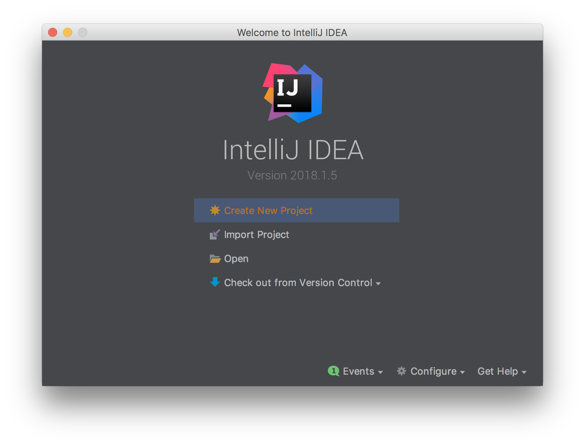
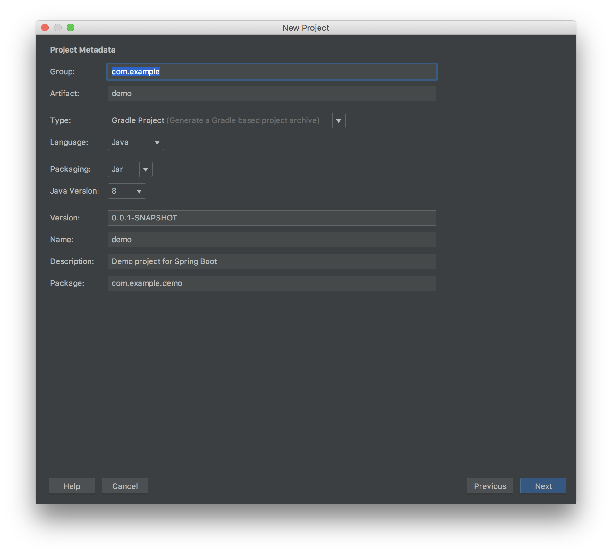
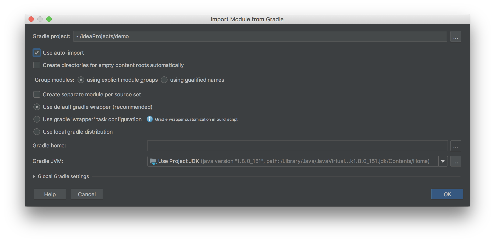
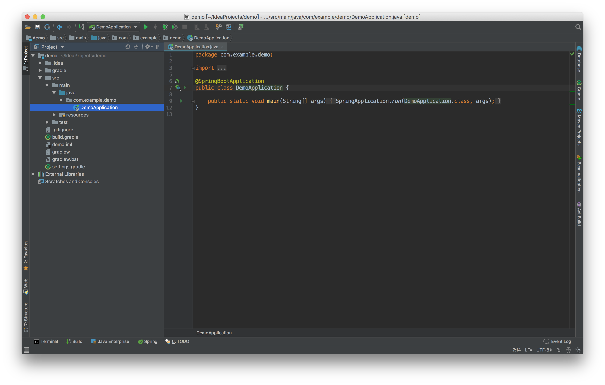

## Spring Boot Web


## IDE

running IntelliJ to create spring boot project











---

## Web

```bash
# main
linux:~/IdeaProjects/demo # vi src/main/java/com/example/demo/DemoApplication.java
package com.example.demo;

import org.springframework.boot.SpringApplication;
import org.springframework.boot.autoconfigure.SpringBootApplication;

@SpringBootApplication
public class DemoApplication {

    public static void main(String[] args) {
        SpringApplication.run(DemoApplication.class, args);
    }
}

# controller
linux:~/IdeaProjects/demo # vi src/main/java/com/example/demo/controller/HomeController.java
package com.example.demo.controller;

import org.springframework.web.bind.annotation.RequestMapping;
import org.springframework.web.bind.annotation.ResponseBody;
import org.springframework.web.bind.annotation.RestController;

@RestController
public class HomeController {
    @RequestMapping("/")
    @ResponseBody
    public String home() {
        return "Hello Spring Boot!";
    }
}

# unit Test
linux:~/IdeaProjects/demo # vi src/test/java/com/example/demo/DemoApplicationTests.java
package com.example.demo;

import com.example.demo.controller.HomeController;
import org.junit.Test;
import org.junit.runner.RunWith;
import org.springframework.boot.test.context.SpringBootTest;
import org.springframework.test.context.junit4.SpringRunner;

import static org.junit.Assert.assertEquals;

@RunWith(SpringRunner.class)
@SpringBootTest
public class DemoApplicationTests {

    @Test
    public void contextLoads() {
    }

    @Test
    public void testHome() {
        assertEquals("Hello Spring Boot!", new HomeController().home());
    }
}

# gradle
linux:~/IdeaProjects/demo # vi build.gradle
buildscript {
    ext {
        springBootVersion = '2.0.3.RELEASE'
    }
    repositories {
        mavenCentral()
    }
    dependencies {
        classpath("org.springframework.boot:spring-boot-gradle-plugin:${springBootVersion}")
    }
}

apply plugin: 'java'
apply plugin: 'eclipse'
apply plugin: 'org.springframework.boot'
apply plugin: 'io.spring.dependency-management'

group = 'com.example'
version = '0.0.1-SNAPSHOT'
sourceCompatibility = 1.8

repositories {
    mavenCentral()
}


dependencies {
    compile('org.springframework.boot:spring-boot-starter-web')
    testCompile('org.springframework.boot:spring-boot-starter-test')
}


# run unit test
linux:~/IdeaProjects/demo # ./gradlew clean test --info
linux:~/IdeaProjects/demo # ./gradlew test -Dtest.single=DemoApplicationTests

# start app
linux:~/IdeaProjects/demo # ./gradlew bootRun

# build jar & run app
linux:~/IdeaProjects/demo # ./gradlew build
linux:~/IdeaProjects/demo # java -jar build/libs/demo-0.0.1-SNAPSHOT.jar

# check web
linux:~ # curl http://127.0.0.1:8080
```

---

## Runner

```bash
# main
linux:~/cmd # vi src/main/java/com/example/cmd/CmdApplication.java
package com.example.cmd;

import com.example.cmd.service.HelloService;
import org.springframework.beans.factory.annotation.Autowired;
import org.springframework.boot.CommandLineRunner;
import org.springframework.boot.SpringApplication;
import org.springframework.boot.autoconfigure.SpringBootApplication;

@SpringBootApplication
public class CmdApplication implements CommandLineRunner {

    @Autowired
    private HelloService helloService;

    public static void main(String[] args) {
        SpringApplication.run(CmdApplication.class, args);
    }

    @Override
    public void run(String... args) throws Exception {
        if (args.length > 0) {
            System.out.println(helloService.getMessage(args[0].toString()));
        } else {
            System.out.println(helloService.getMessage());
        }
    }
}

# service
linux:~/cmd # vi src/main/java/com/example/cmd/service/HelloService.java 
package com.example.cmd.service;

import org.springframework.beans.factory.annotation.Value;
import org.springframework.stereotype.Service;


@Service
public class HelloService {
    @Value("${name:unknown}")
    private String name;

    public String getMessage() {
        return getMessage(name);
    }

    public String getMessage(String name) {
        return "Hello " + name;
    }
}

# property
linux:~/cmd # vi src/main/resources/application.properties 
name=Spring Boot


# gradle
linux:~/cmd # vi build.gradle
buildscript {
    ext {
        springBootVersion = '2.0.3.RELEASE'
    }
    repositories {
        mavenCentral()
    }
    dependencies {
        classpath("org.springframework.boot:spring-boot-gradle-plugin:${springBootVersion}")
    }
}


apply plugin: 'java'
apply plugin: 'eclipse'
apply plugin: 'org.springframework.boot'
apply plugin: 'io.spring.dependency-management'

group = 'com.example'
version = '0.0.1-SNAPSHOT'
sourceCompatibility = 1.8

repositories {
    mavenCentral()
}


dependencies {
    compile('org.springframework.boot:spring-boot-starter')
    testCompile('org.springframework.boot:spring-boot-starter-test')
}

# start app
linux:~/IdeaProjects/demo # ./gradlew bootRun

# build jar & run app
linux:~/IdeaProjects/demo # ./gradlew build
linux:~/IdeaProjects/demo # java -jar build/libs/cmd-0.0.1-SNAPSHOT.jar
linux:~/IdeaProjects/demo # java -jar build/libs/cmd-0.0.1-SNAPSHOT.jar "Spring"
```


---

## AMQP

```bash
# app
linux:~/mq # vi src/main/java/com/example/mq/MqApplication.java
package com.example.mq;

import com.example.mq.service.MqRunner;
import org.springframework.boot.CommandLineRunner;
import org.springframework.boot.SpringApplication;
import org.springframework.boot.autoconfigure.SpringBootApplication;
import org.springframework.context.annotation.Bean;
import org.springframework.context.annotation.Profile;
import org.springframework.scheduling.annotation.EnableScheduling;

@SpringBootApplication
@EnableScheduling
public class MqApplication  {

    public static void main(String[] args) {
        SpringApplication.run(MqApplication.class, args);
    }

    @Profile("usage_message")
    @Bean
    public CommandLineRunner usage() {
        return new CommandLineRunner() {
            @Override
            public void run(String... arg0) throws Exception {
                System.out.println("This app uses Spring Profiles to control its behavior.\n");
                System.out.println("Sample usage: java -jar rabbit-tutorials.jar --spring.profiles.active=hello-world,sender");
                System.out.println("Sample usage: java -jar rabbit-tutorials.jar --spring.profiles.active=hello-world,receiver");
            }
        };
    }

    @Profile("!usage_message")
    @Bean
    public CommandLineRunner tutorial() {
        return new MqRunner();
    }
}

# config
linux:~/mq # vi src/main/java/com/example/mq/MqConfig.java
package com.example.mq;

import com.example.mq.service.MqReceiver;
import com.example.mq.service.MqSender;
import org.springframework.amqp.core.Queue;
import org.springframework.context.annotation.Bean;
import org.springframework.context.annotation.Configuration;
import org.springframework.context.annotation.Profile;

@Profile({"tut1","hello-world"})
@Configuration
public class MqConfig {
    @Bean
    public Queue hello() {
        return new Queue("spring-boot-queue");
    }

    @Profile("receiver")
    @Bean
    public MqReceiver receiver() {
        return new MqReceiver();
    }

    @Profile("sender")
    @Bean
    public MqSender sender() {
        return new MqSender();
    }
}

# runner
linux:~/mq # vi src/main/java/com/example/mq/service/MqRunner.java
package com.example.mq.service;

import org.springframework.beans.factory.annotation.Autowired;
import org.springframework.beans.factory.annotation.Value;
import org.springframework.boot.CommandLineRunner;
import org.springframework.context.ConfigurableApplicationContext;


public class MqRunner implements CommandLineRunner {
    @Value("${tutorial.client.duration:0}")
    private int duration;

    @Autowired
    private ConfigurableApplicationContext ctx;

    @Override
    public void run(String... arg0) throws Exception {
        System.out.println("Ready ... running for " + duration + "ms");
        Thread.sleep(duration);
        ctx.close();
    }
}

# sender
linux:~/mq # vi src/main/java/com/example/mq/service/MqSender.java
package com.example.mq.service;

import org.springframework.amqp.core.Queue;
import org.springframework.amqp.rabbit.core.RabbitTemplate;
import org.springframework.beans.factory.annotation.Autowired;
import org.springframework.scheduling.annotation.Scheduled;

public class MqSender {
    @Autowired
    private RabbitTemplate template;

    @Autowired
    private Queue queue;

    @Scheduled(fixedDelay = 1000, initialDelay = 500)
    public void send() {
        String message = "Hello World!";
        this.template.convertAndSend(queue.getName(), message);
        System.out.println(" [x] Sent '" + message + "'");
    }
}

# recevier
linux:~/mq # vi src/main/java/com/example/mq/service/MqReceiver.java
package com.example.mq.service;

import org.springframework.amqp.rabbit.annotation.RabbitHandler;
import org.springframework.amqp.rabbit.annotation.RabbitListener;

@RabbitListener(queues = "hello")
public class MqReceiver {
    @RabbitHandler
    public void receive(String in) {
        System.out.println(" [x] Received '" + in + "'");
    }
}


buildscript {
    ext {
        springBootVersion = '2.0.3.RELEASE'
    }
    repositories {
        mavenCentral()
    }
    dependencies {
        classpath("org.springframework.boot:spring-boot-gradle-plugin:${springBootVersion}")
    }
}

# property
linux:~/mq # vi mq src/main/resources/application.properties
spring.profiles.active=usage_message
logging.level.org= ERROR
tutorial.client.duration=10000


spring.rabbitmq.host=172.17.43.216
spring.rabbitmq.port=5672
spring.rabbitmq.username=admin
spring.rabbitmq.password=arris!234

# gradle
linux:~/mq # vi build.gradle
apply plugin: 'java'
apply plugin: 'eclipse'
apply plugin: 'org.springframework.boot'
apply plugin: 'io.spring.dependency-management'

group = 'com.example'
version = '0.0.1-SNAPSHOT'
sourceCompatibility = 1.8

repositories {
    mavenCentral()
}


dependencies {
    compile('org.springframework.boot:spring-boot-starter-amqp')
    testCompile('org.springframework.boot:spring-boot-starter-test')
}

# build
linux:~/mq # ./gradlew build

# run
linux:~/mq # java -jar build/libs/mq-0.0.1-SNAPSHOT.jar --spring.profiles.active=hello-world,sender
linux:~/mq # java -jar build/libs/mq-0.0.1-SNAPSHOT.jar --spring.profiles.active=hello-world,receiver
```


---

## Schedule

```bash
# app
linux:~/demo # vi src/main/java/com/example/shecule/SheculeApplication.java
package com.example.shecule;

import org.springframework.boot.SpringApplication;
import org.springframework.boot.autoconfigure.SpringBootApplication;
import org.springframework.scheduling.annotation.EnableScheduling;

@SpringBootApplication
@EnableScheduling
public class SheculeApplication {

    public static void main(String[] args) {
        SpringApplication.run(SheculeApplication.class, args);
    }
}

# scheduled task
linux:~/scheduled # vi src/main/java/com/example/shecule/ScheduledTask.java
package com.example.shecule;

import org.springframework.scheduling.annotation.Scheduled;
import org.springframework.stereotype.Component;

import java.text.SimpleDateFormat;
import java.util.Date;

@Component
public class ScheduledTask {
    private static final SimpleDateFormat dateFormat = new SimpleDateFormat("yyyy-MM-dd HH:mm:ss");
    private Integer count0 = 1;
    private Integer count1 = 1;
    private Integer count2 = 1;

    @Scheduled(fixedRate = 5000)
    public void reportCurrentTime() throws InterruptedException {
        System.out.println(String.format("---count: %s, time: %s", count0++, dateFormat.format(new Date())));
    }

    @Scheduled(fixedDelay = 5000)
    public void reportCurrentTimeAfterSleep() throws InterruptedException {
        System.out.println(String.format("===count: %s, time: %s", count1++, dateFormat.format(new Date())));
    }

    @Scheduled(cron = "0 0 1 * * *")
    public void reportCurrentTimeCron() throws InterruptedException {
        System.out.println(String.format("+++count: %s, time: %s", count2++, dateFormat.format(new Date())));
    }
}

# gradle
linux:~/scheduled # vi build.gradle
buildscript {
    ext {
        springBootVersion = '2.0.3.RELEASE'
    }
    repositories {
        mavenCentral()
    }
    dependencies {
        classpath("org.springframework.boot:spring-boot-gradle-plugin:${springBootVersion}")
    }
}

apply plugin: 'java'
apply plugin: 'eclipse'
apply plugin: 'org.springframework.boot'
apply plugin: 'io.spring.dependency-management'

group = 'com.example'
version = '0.0.1-SNAPSHOT'
sourceCompatibility = 1.8

repositories {
    mavenCentral()
}


dependencies {
    compile('org.springframework.boot:spring-boot-starter')
    testCompile('org.springframework.boot:spring-boot-starter-test')
}
```
