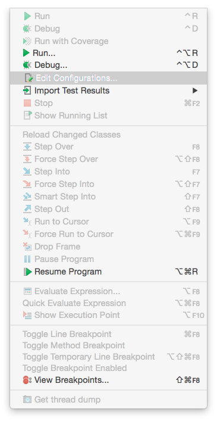

# Strust

## Introduction


## Run


### Tomcat

```
Linux:~ # tree hello/
hello/
├── HelloWorld.jsp
├── index.jsp
├── src
│   └── com
│       └── tutorialspoint
│           └── struts2
│               └── HelloWorldAction.java
└── WEB-INF
    ├── classes
    │   ├── com
    │   │   └── tutorialspoint
    │   │       └── struts2
    │   │           └── HelloWorldAction.class
    │   └── struts.xml
    ├── lib
    │   ├── asm-commons.jar
    │   ├── asm.jar
    │   ├── asm-tree.jar
    │   ├── commons-fileupload.jar
    │   ├── commons-io.jar
    │   ├── commons-lang.jar
    │   ├── freemarker.jar
    │   ├── javassist.jar
    │   ├── ognl.jar
    │   ├── struts2-core.jar
    │   └── xwork-core.jar
    └── web.xml

Linux:~ # cat hello/index.jsp
<%@ page language="java" contentType="text/html; charset=ISO-8859-1"
         pageEncoding="ISO-8859-1"%>
<%@ taglib prefix="s" uri="/struts-tags"%>
<!DOCTYPE html PUBLIC "-//W3C//DTD HTML 4.01 Transitional//EN"
"http://www.w3.org/TR/html4/loose.dtd">
<html>
<head>
  <title>Hello World</title>
</head>
<body>
<h1>Hello World From Struts2</h1>
<form action="hello">
  <label for="name">Please enter your name</label><br/>
  <input type="text" name="user"/>
  <input type="submit" value="Say Hello"/>
</form>
</body>

Linux:~ # cat hello/HelloWorld.jsp 
<%@ page contentType="text/html; charset=UTF-8" %>
<%@ taglib prefix="s" uri="/struts-tags" %>
<html>
<head>
    <title>Hello World</title>
</head>
<body>
Hello World, <s:property value="user"/>
</body>
</html>

Linux:~ # cat hello/src/com/tutorialspoint/struts2/HelloWorldAction.java 
package com.tutorialspoint.struts2;

public class HelloWorldAction {
    private String user;

    public String execute() throws Exception {
        return "success";
    }

    public String getUser() {
        return user;
    }

    public void setUser(String name) {
        this.user = name;
    }
}

Linux:~ # cat hello/WEB-INF/classes/struts.xml 
<?xml version="1.0" encoding="UTF-8"?>
<!DOCTYPE struts PUBLIC
        "-//Apache Software Foundation//DTD Struts Configuration 2.3//EN"
        "http://struts.apache.org/dtds/struts-2.3.dtd">
<struts>
    <constant name="struts.devMode" value="true" />
    <package name="helloworld" extends="struts-default">

        <action name="hello"
                class="com.tutorialspoint.struts2.HelloWorldAction"
                method="execute">
            <result name="success">/HelloWorld.jsp</result>
        </action>
    </package>
</struts>

Linux:~ # cat hello/WEB-INF/web.xml 
<?xml version="1.0" encoding="UTF-8"?>
<web-app xmlns="http://xmlns.jcp.org/xml/ns/javaee"
         xmlns:xsi="http://www.w3.org/2001/XMLSchema-instance"
         xsi:schemaLocation="http://xmlns.jcp.org/xml/ns/javaee http://xmlns.jcp.org/xml/ns/javaee/web-app_3_1.xsd"
         version="3.1">
    <filter>
        <filter-name>struts2</filter-name>
        <filter-class>org.apache.struts2.dispatcher.ng.filter.StrutsPrepareAndExecuteFilter</filter-class>
    </filter>
    <filter-mapping>
        <filter-name>struts2</filter-name>
        <url-pattern>/*</url-pattern>
    </filter-mapping>
</web-app>

Linux:~ # javac -d . hello/src/com/tutorialspoint/struts2/HelloWorldAction.java

Linux:~ # mv com/tutorialspoint/struts2/HelloWorldAction.class hello/WEB-INF/classes/com/tutorialspoint/struts2/HelloWorldAction.class


Linux:~ # cp -r hello/ /opt/apache-tomcat/webapps/
```


### Maven

```
Linux:~ # mvn archetype:generate -DgroupId=com.tutorialspoint.struts2 -DartifactId=hello -DinteractiveMode=false -DarchetypeArtifactId=maven-archetype-webapp

Linux:~ # vi hello/src/main/webapp/index.jsp
<%@ page language="java" contentType="text/html; charset=ISO-8859-1"
         pageEncoding="ISO-8859-1"%>
<%@ taglib prefix="s" uri="/struts-tags"%>
<!DOCTYPE html PUBLIC "-//W3C//DTD HTML 4.01 Transitional//EN"
"http://www.w3.org/TR/html4/loose.dtd">
<html>
<head>
  <title>Hello World</title>
</head>
<body>
<h1>Hello World From Struts2</h1>
<form action="hello">
  <label for="name">Please enter your name</label><br/>
  <input type="text" name="user"/>
  <input type="submit" value="Say Hello"/>
</form>
</body>

Linux:~ # vi hello/src/main/webapp/HelloWorld.jsp
<%@ page contentType="text/html; charset=UTF-8" %>
<%@ taglib prefix="s" uri="/struts-tags" %>
<html>
<head>
    <title>Hello World</title>
</head>
<body>
Hello World, <s:property value="user"/>
</body>
</html>

Linux:~ # mkdir -p hello/src/main/java/com/tutorialspoint/struts2

Linux:~ # vi hello/src/main/java/com/tutorialspoint/struts2/HelloWorldAction.java 
package com.tutorialspoint.struts2;

public class HelloWorldAction {
    private String user;

    public String execute() throws Exception {
        return "success";
    }

    public String getUser() {
        return user;
    }

    public void setUser(String name) {
        this.user = name;
    }
}

Linux:~ # vi hello/src/main/resources/struts.xml
<?xml version="1.0" encoding="UTF-8"?>
<!DOCTYPE struts PUBLIC
        "-//Apache Software Foundation//DTD Struts Configuration 2.3//EN"
        "http://struts.apache.org/dtds/struts-2.3.dtd">
<struts>
    <constant name="struts.devMode" value="true" />
    <package name="helloworld" extends="struts-default">

        <action name="hello"
                class="com.tutorialspoint.struts2.HelloWorldAction"
                method="execute">
            <result name="success">/HelloWorld.jsp</result>
        </action>
    </package>
</struts>

Linux:~ # vi hello/src/main/webapp/WEB-INF/web.xml
<!DOCTYPE web-app PUBLIC
 "-//Sun Microsystems, Inc.//DTD Web Application 2.3//EN"
 "http://java.sun.com/dtd/web-app_2_3.dtd" >

<web-app>
  <display-name>Archetype Created Web Application</display-name>
    <filter>
        <filter-name>struts2</filter-name>
        <filter-class>org.apache.struts2.dispatcher.ng.filter.StrutsPrepareAndExecuteFilter</filter-class>
    </filter>
    <filter-mapping>
        <filter-name>struts2</filter-name>
        <url-pattern>/*</url-pattern>
    </filter-mapping>
</web-app>

Linux:~ # vi hello/pom.xml
<project xmlns="http://maven.apache.org/POM/4.0.0" xmlns:xsi="http://www.w3.org/2001/XMLSchema-instance"
  xsi:schemaLocation="http://maven.apache.org/POM/4.0.0 http://maven.apache.org/maven-v4_0_0.xsd">
  <modelVersion>4.0.0</modelVersion>
  <groupId>com.tutorialspoint.struts2</groupId>
  <artifactId>hello</artifactId>
  <packaging>war</packaging>
  <version>1.0-SNAPSHOT</version>
  <name>hello Maven Webapp</name>
  <url>http://maven.apache.org</url>
  <dependencies>
    <dependency>
      <groupId>junit</groupId>
      <artifactId>junit</artifactId>
      <version>3.8.1</version>
      <scope>test</scope>
    </dependency>
    <dependency>
      <groupId>org.apache.struts</groupId>
      <artifactId>struts2-core</artifactId>
      <version>2.3.24</version>
    </dependency>

  </dependencies>
  <build>
    <finalName>hello</finalName>
  </build>
</project>

Linux:~ # mvn -f hello/pom.xml clean package

Linux:~ # cp hello/target/hello.war /opt/apache-tomcat/webapps
```


### IntelliJ IDEA

`新建 Strust2 Project`


`設定 tomcat`





`設定 lib`


