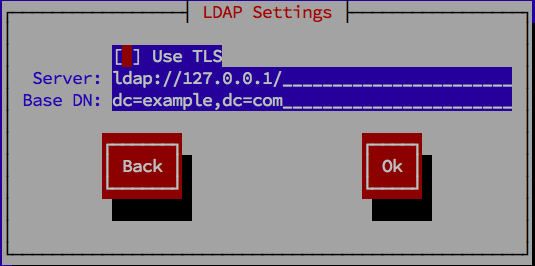

### localectl ###

	rhel:~ # localectl status
	rhel:~ # localectl help

	rhel:~ # system enable systemd-localed
	rhel:~ # system start systemd-localed

`System Locale`

	# setup
	rhel:~ # localectl list-locales
	rhel:~ # localectl set-locale LANG=zh_TW.utf8

	# config file
	rhel:~ # cat /etc/locale.conf
	LANG=en_US.utf8
	LC_MESSAGES=C

	# other method
	rhel:~ # locale
	rhel:~ # locale --all

`Keyboard Layout`

	# setup
	rhel:~ # localectl list-keymaps
	rhel:~ # localectl set-keymap us
	rhel:~ # localectl set-x11-keymap de

	# config file
	rhel:~ # /etc/vconsole.conf
	KEYMAP="us"
	FONT="latarcyrheb-sun16"

	rhel:~ # ls /lib/kbd/keymaps
	rhel:~ # loadkeys -d

### timedatectl ###

`Date And Time`

	rhel:~ # timedatectl status
	rhel:~ # timedatectl help

	rhel:~ # systemctl enable systemd-timedated
	rhel:~ # systemctl enable chronyd

	rhel:~ # timedatectl set-time HH:MM:SS # 24 小時制
	rhel:~ # timedatectl list-timezones
	rhel:~ # timedatectl set-timezone Asia/Taipei
	rhel:~ # timedatectl set-ntp yes # 會使用 NTP server 更新

	rhel:~ # ls /usr/share/zoneinfo
	rhel:~ # ln -sf /usr/share/zoneinfo/Asia/Taipei /etc/localtime
	rhel:~ # export TZ=Asia/Taipei

`date`

	rhel:~ # date -s HH:MM:SS
	rhel:~ # date -s YYYY-MM-DD
	rhel:~ # date -s YYYY-MM-DD HH:MM:SS

`hwclock`

	rhel:~ # hwclock -w
	rhel:~ # hwclock -s

### User And Group ###

uid (user ID), gid (group ID) 系統預設起始值在 /etc/login.defs
shell 系統預設可使用值 /etc/shells
至於 useradd 設定值在 /etc/default/useradd

`User`

	rhel:~ # useradd user # 新增使用者
	rhel:~ # useradd -u uid -g gid user # 新增使用者, 且指定 uid, gid
	rhel:~ # useradd -N -G group1,group2 user # 將 user 加入到 group1, group2, ... 但沒有 upg
	rhel:~ # useradd -e YYYY-MM-DD user # 帳號過期 YYYY-MM-DD (-1: 永不過期)
	rhel:~ # useradd -f DD user # DD 日後要改密碼 (0: 馬上過期, -1: 永不過期)
	rhel:~ # useradd -s /sbin/nologin -r sysuser # 新增系統使用者, 禁止使用者登入

	rhel:~ # usermod -G group user # user 加入到 group, 原本的已加入的群組都會被移除
	rhel:~ # usermod -aG group user # user 加入到 group, 除了原本的群組之外還會多加 group

	rhel:~ # userdel user # 刪除使用者, 但會留下 HOME, MAIL_DIR
	rhel:~ # userdel -r user # 刪除使用者, 包括等 HOME, MAIL_DIR

	rhel:~ # passwd user # 設定 user 密碼 
	rhel:~ # chage -l user # 看帳號狀態

`Group`

	rhel:~ # groupadd group

	rhel:~ # gpasswd -a user group # user 加入 group
	rhel:~ # gpasswd -d user group # user 離開 group

	rhel:~ # rhel:~ # groupdel group

`設定群組`

	rhel:~ # mkdir /opt/myproject
	rhel:~ # groupadd myproject
	rhel:~ # chown root:myproject /opt/myproject
	rhel:~ # chmod 2775 /opt/myproject
	rhel:~ # ls -ld /opt/myproject
	rhel:~ # usermod -aG myproject username

`加入系統管理群組`

	rhel:~ # usermod -G wheel user
	rhel:~ # vi /etc/pam.d/su
	#auth           required        pam_wheel.so use_uid

`sudo`

/etc/sudoers
Defaults    timestamp_timeout=value
%users localhost=/sbin/shutdown -h now
juan ALL=(ALL) ALL

/etc/pam.d/system-auth
session required pam_tty_audit.so disable=pattern enable=pattern
session required pam_tty_audit.so disable=* enable=root

/var/log/messages
/var/log/secure

### YUM ###

`Repository`

	rhel:~ # yum repolist
	rhel:~ # yum repolist all
	rhel:~ # yum repolist -v
	rhel:~ # yum repoinfo

`Package`

	# search
	rhel:~ # yum search term
	rhel:~ # yum list all # show installed and available package
	rhel:~ # yum list glob_expression
	rhel:~ # yum list available glob_expression
	rhel:~ # yum list installed glob_expression
	rhel:~ # yum provides glob_expression

	rhel:~ # yum list *log*
	rhel:~ # yum provides "*bin/named"

	# info
	rhel:~ # yum info package_name
	rhel:~ # yumdb info package_name

	# install
	rhel:~ # yum install package_name
	rhel:~ # yum install glob_expression
	rhel:~ # yum install-n name
	rhel:~ # yum install-na name.architecture
	rhel:~ # yum install-nevra name-epoch:version-release.architecture
	rhel:~ # yum localinstall path

	rhel:~ # yum install audacious-plugins-\*
	rhel:~ # yum install /usr/sbin/named

	# remove
	rhel:~ # yum remove package_name

	# update
	rhel:~ # yum check-update
	rhel:~ # yum update package_name # update package
	rhel:~ # yum group update group_name
	rhel:~ # yum update # update all package

下載的 package 放在 /var/cache/yum/$basearch/$releasever/packages 目錄下

`Package Group`

	rhel:~ # yum group list glob_expression
	rhel:~ # yum group info glob_expression
	rhel:~ # yum group ids

	# install
	rhel:~ # yum group install "KDE Desktop"
	rhel:~ # yum group install kde-desktop
	rhel:~ # yum install @"KDE Desktop"
	rhel:~ # yum install @kde-desktop

	# remove
	rhel:~ # yum group remove "KDE Desktop"
	rhel:~ # yum group remove kde-desktop
	rhel:~ # yum remove @"KDE Desktop"
	rhel:~ # yum remove @kde-desktop

`History`

	rhel:~ # yum history list
	rhel:~ # yum history list all
	rhel:~ # yum history list 1..3

	rhel:~ # yum history summary
	rhel:~ # yum history summary 1..3
	rhel:~ # yum history summary glob_expression

	rhel:~ # yum history info 1
	rhel:~ # yum history info 1..3

	rhel:~ # yum history package-list glob_expression

	rhel:~ # yum history undo id
	rhel:~ # yum history redo id

	rhel:~ # yum history new

YUM 使用 SQLite 存放在 /var/lib/yum/history/ 目錄下

`[main]`

	rhel:~ # cat /etc/yum.conf
	[main]
	cachedir=/var/cache/yum/$basearch/$releasever
	keepcache=0
	debuglevel=2
	logfile=/var/log/yum.log
	exactarch=1
	obsoletes=1
	gpgcheck=1
	plugins=1
	installonly_limit=3

`[repository]`

	rhel:~ # cat /etc/yum.repo.d/example.repo
	[InstallMedia]
	baseurl=file:///mnt/rhel-server
	name=Red Hat Enterprise Linux 7.1
	mediaid=1424360759.989976
	metadata_expire=-1
	gpgcheck=0
	cost=500

`Config`

	rhel:~ # yum-config-manager
	rhel:~ # yum-config-manager section
	rhel:~ # yum-config-manager glob_expression…

	rhel:~ # yum-config-manager --add-repo repository_url
	rhel:~ # yum-config-manager --add-repo http://www.example.com/example.repo

	rhel:~ # yum-config-manager --enable repository
	rhel:~ # yum-config-manager --enable glob_expression
	rhel:~ # yum-config-manager --disable repository
	rhel:~ # yum-config-manager --disable glob_expression

`Create Yum Repository`

	rhel:~ # yum install createrepo
	rhel:~ # createrepo --database /mnt/local_repo

### Systemd ###

| Unit Type			| File Extension	| Description															|
| ----------------- | ----------------- | --------------------------------------------------------------------- |
| Service unit		| .service			| system service														|
| Target unit		| .target			| group of systemd units												|
| Automount unit	| .automount		| file system automount point											|
| Device unit		| .device			| device file recognized by the kernel									|
| Mount unit		| .mount			| file system mount point												|
| Path unit			| .path				| file or directory in a file system									|
| Scope unit		| .scope			| externally created process											|
| Slice unit		| .slice			| group of hierarchically organized units that manage system processes	|
| Snapshot unit		| .snapshot			| saved state of the systemd manager									|
| Socket unit		| .socket			| inter-process communication socket									|
| Swap unit			| .swap				| swap device or a swap file											|
| Timer unit		| .timer			| systemd timer															|

Directory					Description
/usr/lib/systemd/system/	Systemd units distributed with installed RPM packages.
/run/systemd/system/		Systemd units created at run time. This directory takes precedence over the directory with installed service units.
/etc/systemd/system/		Systemd units created and managed by the system administrator. This directory takes precedence over the directory with runtime units.

`service `

| service					| systemctl									|
| ------------------------- | ----------------------------------------- |
| service name start		| systemctl start name.service				|
| service name stop			| systemctl stop name.service				|
| service name restart		| systemctl restart name.service			|
| service name condrestart	| systemctl try-restart name.service		|
| service name reload		| systemctl reload name.service				|
| service name status		| systemctl status name.service				|
| service --status-all		| systemctl list-units --type service --all	|

`chkconfig`

| chkconfig					| systemctl									|
| ------------------------- | ----------------------------------------- |
| chkconfig name on			| systemctl enable name.service				|
| chkconfig name off		| systemctl disable name.service			|
| chkconfig --list name		| systemctl status name.service				|
| chkconfig --list			| systemctl list-unit-files --type service	|

	# chkconfig off
	rhel:~ # systemctl mask name.service
	rhel:~ # systemctl disable name.service

	# chkconfig on
	rhel:~ # systemctl umask name.service
	rhel:~ # systemctl enable name.service

enable/disable create/remove soft link
mask/umask link to /dev/null

`Runlevel`

| Runlevel	| Target Units							|
| --------- | ------------------------------------- |
| 0			| runlevel0.target, poweroff.target		|
| 1			| runlevel1.target, rescue.target		|
| 2			| runlevel2.target, multi-user.target	|
| 3			| runlevel3.target, multi-user.target	|
| 4			| runlevel4.target, multi-user.target	|
| 5			| runlevel5.target, graphical.target	|
| 6			| runlevel6.target, reboot.target		|

SysV	LSB
runlevel			systemctl list-units --type target
telinit runlevel	systemctl isolate name.target

systemctl get-default
systemctl set-default graphical.target
systemctl isolate multi-user.target
systemctl rescue
systemctl --no-wall rescue
systemctl emergency
systemctl --no-wall emergency

`Power Management`

| Old Command		| New Command			|
| ----------------- | --------------------- |
| halt				| systemctl halt		|
| poweroff			| systemctl poweroff	|
| reboot			| systemctl reboot		|
| pm-suspend		| systemctl suspend		|
| pm-hibernate		| systemctl hibernate	|
| pm-suspend-hybrid	| systemctl hybrid-sleep|

`Remote Machine`

	rhel:~ # systemctl -H root@server-01.example.com status httpd.service

`System Unit File`

### OpenSSH ###

`System-wide configuration files`

* /etc/ssh/ssh\_config
* /etc/ssh/sshd\_config
* /etc/ssh/moduli
* /etc/ssh/ssh\_host_ecdsa_key
* /etc/ssh/ssh\_host_ecdsa_key.pub
* /etc/ssh/ssh\_host_key
* /etc/ssh/ssh\_host_key.pub
* /etc/ssh/ssh\_host_rsa_key
* /etc/ssh/ssh\_host_rsa_key.pub
* /etc/pam.d/sshd
* /etc/sysconfig/sshd

`User-specific configuration files`

* ~/.ssh/known\_hosts
* ~/.ssh/authorized\_keys
* ~/.ssh/id\_ecdsa
* ~/.ssh/id\_ecdsa.pub
* ~/.ssh/id\_rsa
* ~/.ssh/id\_rsa.pub
* ~/.ssh/identity
* ~/.ssh/identity.pub

`Starting an OpenSSH Server`

	rhel:~ # systemctl start sshd.service
	rhel:~ # systemctl stop sshd.service
	rhel:~ # systemctl enable sshd.service

`Using Key-based Authentication`

	rhel:~ # vi /etc/ssh/sshd_config
	PasswordAuthentication no

`Generating Key Pairs`

	rhel:~ # ssh-keygen -t rsa
	rhel:~ # ssh-copy-id [-i ~/.ssh/id_rsa.pub] user@hostname

`Configuring ssh-agent`

	rhel:~ # ssh-add
	rhel:~ # ssh-agent
	rhel:~ # ssh-agent -k

`Utility`

	rhel:~ # ssh [username@]hostname
	rhel:~ # ssh [username@]hostname command

	rhel:~ # ssh-keygen -l -f /etc/ssh/ssh_host_ecdsa_key.pub
	rhel:~ # ssh-keygen -R penguin.example.com

	rhel:~ # scp localfile [username@]hostname:remotefile
	rhel:~ # scp [username@]hostname:remotefile localfile

	rhel:~ # sftp [username@]hostname

`X11 Forwarding`

	rhel:~ # ssh -Y username@hostname

`Port Forwarding`

In\_Host(9000)   ----|--->   Out\_Host(2000)

	In_Host:~ $ ssh -L 9000:localhost:2000 Out_Host

In\_Host(9000)   <---|----   Out\_Host(2000)

	In_Host:~ $ ssh -R 9000:localhost:2000 Out_Host

### VNC ###

`Starting VNC Server`

	rhel:~ # yum install tigervnc-server
	rhel:~ # cp /lib/systemd/system/vncserver@.service /etc/systemd/system/.
	rhel:~ # vi /etc/systemd/system/vncserver@.service
	ExecStart=/sbin/runuser -l USER -c "/usr/bin/vncserver %i -geometry 1280x1024"
	PIDFile=/home/USER/.vnc/%H%i.pid

	rhel:~ # systemctl start vncserver@:display_number.service
	rhel:~ # systemctl enable vncserver@:display_number.service
	rhel:~ # systemctl disable vncserver@:display_number.service
	rhel:~ # systemctl stop vncserver@:display_number.service

	rhel:~ # firewall-cmd --list-all
	rhel:~ # firewall-cmd --add-rich-rule='rule family="ipv4" source address="192.168.122.116" service name=vnc-server accept'
	rhel:~ # firewall-cmd --zone=public --add-port=5904/tcp

	rhel:~ # systemctl daemon-reload
	rhel:~ # su - USER
	rhel:~ # vncpasswd

`Configuring VNC Server for Two Users`

	rhel:~ # systemctl start vncserver-USER_1@:3.service
	rhel:~ # systemctl start vncserver-USER_2@:5.service

`Starting VNC Client`

	rhel:~ # yum install tigervnc
	rhel:~ # vncviewer address:display_number
	rhel:~ # vncviewer -via user@host:display_number # by ssh

### HTTP ###

/etc/httpd/conf/httpd.conf
/etc/httpd/conf.modules.d/

| RHEL 6								|	RHEL 7							|
| ------------------------------------- | ----------------------------------|
| httpd 2.2								| httpd 2.4							|
| /usr/sbin/apxs 						| /usr/bin/apxs						|
| mod\_auth\_mysql, mod\_auth\_pgsql	| mod\_authn\_dbd					|
| mod\_ldap, mod\_perl					| mod\_proxy\_html, mod\_xml2enc	|
| /var/cache/mod_proxy/					| /var/cache/httpd/					|
| /var/www/icons/						| /usr/share/httpd/icons			|
| /var/www/manual/						| /usr/share/httpd/manual/			|
| /var/www/error/						| /usr/share/httpd/error/			|
| /var/log/httpd/suexec.log				| /var/log/secure					|
| service httpd graceful				| apachectl graceful				|
| service httpd configtest				| apachectl configtest				|
| none									| /etc/httpd/conf.d/autoindex.conf	|
| none									| /etc/httpd/conf.d/userdir.conf	|
| none									| /etc/httpd/conf.d/welcome.conf	|

	rhel:~ # yum install httpd

	rhel:~ # systemctl start httpd.service
	rhel:~ # systemctl enable httpd.service
	rhel:~ # systemctl stop httpd.service
	rhel:~ # systemctl disable httpd.service
	rhel:~ # systemctl restart httpd.service

	rhel:~ # systemctl reload httpd.service
	rhel:~ # apachectl graceful

	rhel:~ # systemctl is-active httpd.service

	rhel:~ # apachectl configtest

	rhel:~ # firewall-cmd --add-service http
	rhel:~ # firewall-cmd --add-service https

`Modules`

/usr/lib/httpd/modules/
/usr/lib64/httpd/modules/

	rhel:~ # cat /etc/httpd/conf.modules.d/xxx.conf
	LoadModule ssl\_module modules/mod\xxx.so

	rhel:~ # yum install httpd-devel
	rhel:~ # apxs -i -a -c module_name.c

`Virtual Hosts`

	rhel:~ # cp /usr/share/doc/httpd-X.Y.Z/httpd-vhosts.conf /etc/httpd/conf.d/

`SSL Server`

SSL/TLS over HTTP, referred to as HTTPS

	rhel:~ # yum install mod_ssl openssl

	rhel:~ # vi /etc/httpd/conf.d/ssl.conf
	SSLProtocol all -SSLv2 # disable SSL v2
	SSLProtocol -all +TLSv1 +TLSv1.1 +TLSv1.2 # enable TLS

	rhel:~ # systemctl restart httpd

	rhel:~ # openssl s_client -connect hostname:port -protocol
	rhel:~ # openssl s_client -connect localhost:443 -ssl3
	rhel:~ # openssl s_client -connect localhost:443 -tls1_2

`NSS`

	rhel:~ # yum remove mod_ssl
	rhel:~ # yum install mod_nss
	rhel:~ # vi /etc/httpd/conf.d/nss.conf
	Listen 443
	VirtualHost _default_:443
	NSSCertificateDatabase /etc/httpd/alias
	NSSPassPhraseDialog file:/etc/httpd/password.conf
	NSSNickname Server-Cert

	rhel:~ # chmod 640 /etc/httpd/password.conf
	rhel:~ # chown root:apache /etc/httpd/password.conf
	rhel:~ # vi /etc/httpd/password.conf
	internal:password

	rhel:~ # certutil -L -d /etc/httpd/alias # list NSS db
	rhel:~ # certutil -W -d /etc/httpd/alias # set password
	rhel:~ # certutil -d /etc/httpd/nss-db-directory/ -A -n "CA_certificate" -t CT,, -a -i certificate.pem

`NSS with/without SSL/TLS`

	rhel:~ # vi /etc/httpd/conf.d/nss.conf
	NSSProtocol TLSv1.0,TLSv1.1

	rhel:~ # openssl s_client -connect localhost:443 -ssl3
	rhel:~ # openssl s_client -connect localhost:443 -tls1

`Generating a New Key and Certificate`

	# method 1:
	rhel:~ # yum install crypto-utils

	rhel:~ # rm /etc/pki/tls/private/hostname.key
	rhel:~ # genkey hostname # 會替換掉 /etc/pki/tls/private/hostname.key, 所以要先刪除

	# method 2:
	rhel:~ # openssl genrsa 1024 > hostname.key
	rhel:~ # openssl req -new -key hostname.key -out hostname.csr
	rhel:~ # openssl req -x509 -key hostname.key -in hostname.csr > hostname.crt
	rhel:~ # openssl req -noout -text -in hostname.csr # verify csr

	# method 3:
	rhel:~ # openssl req -x509 -new -set_serial number -key hostname.key -out hostname.crt

	rhel:~ # vi /etc/httpd/conf.d/ssl.conf
	SSLCertificateFile /etc/pki/tls/certs/hostname.crt
	SSLCertificateKeyFile /etc/pki/tls/private/hostname.key

### MAIL ###

	* Mail Transport Protocols: SMTP/Simple Mail Transfer Protocol
	* Mail Access Protocols: POP/Post Office Protocol and IMAP/Internet Message Access Protocol
	* LMTP/Local Mail Transfer Protocol

`POP and IMAP`

	* APOP — POP3 with MD5 authentication.
	* KPOP — POP3 with Kerberos authentication.
	* RPOP — POP3 with RPOP authentication.

`Dovecot`

	rhel:~ # yum install dovecot

	rhel:~ # vi /etc/dovecot/dovecot.conf
	protocols = imap pop3 lmtp

	rhel:~ # systemctl restart dovecot
	rhel:~ # systemctl enable dovecot

	rhel:~ # vi /etc/dovecot/conf.d/10-ssl.conf
	ssl_protocols = !SSLv2 !SSLv3

`Dovecot with SSL`

	rhel:~ # rm -f certs/dovecot.pem private/dovecot.pem
	rhel:~ # /usr/libexec/dovecot/mkcert.sh

	rhel:~ # vi /etc/dovecot/conf.d/10-ssl.conf
	ssl_cert = /etc/pki/dovecot/certs/dovecot.pem
	ssl_key = /etc/pki/dovecot/private/dovecot.pem

`MTA`

	* MTA/Mail Transport Agent (SMTP) (Postfix, Sendmail, and Fetchmail)
	* MDA/Mail Delivery Agent or LDA/Local Delivery Agent (SMTP, LMTP) (Postfix, Sendmail) (mail, procmail)
	* MUA/Mail User Agent (POP, IMAP)

	rhel:~ # alternatives --config mta # setup mta
	rhel:~ # systemctl enable service
	rhel:~ # systemctl disable service

`Postfix`

/etc/postfix/
access
main.cf
master.cf
transport

	rhel:~ # vi /etc/postfix/main.cf
	myhostname = virtual.domain.tld
	mydomain = domain.tld
	myorigin = $mydomain
	mydestination = $myhostname, localhost.$mydomain, localhost
	mynetworks_style = subnet
	mynetworks = 168.100.189.0/28, 127.0.0.0/8
	inet_interfaces = localhost

	rhel:~ # grep -E '(#|^)my' /etc/postfix/main.cf

	rhel:~ # systemctl start postfix.service
	rhel:~ # systemctl enable postfix.service
	rhel:~ # systemctl reload postfix.service

	rhel:~ # postconf -n # 顯示目前設定
	rhel:~ # postconf -h # 顯示未設定變數
	rhel:~ # postconf -e "alias_maps = hash:/etc/aliases"
	rhel:~ # postconf -M
	rhel:~ # postconf -m
	rhel:~ # postconf -l

	rhel:~ # postqueue -p

	rhel:~ # postalias hash:/etc/aliases 
	rhel:~ # postmap hash:/etc/postfix/access 

`Postfix with LDAP`

	rhel:~ # vi /etc/postfix/main.cf
	alias_maps = hash:/etc/aliases, ldap:/etc/postfix/ldap-aliases.cf

	rhel:~ # vi /etc/postfix/ldap-aliases.cf
	server_host = ldap.example.com
	search_base = dc=example, dc=com

`Sendmail`

/etc/mail/
sendmail.mc
sendmail.cf
access
domaintable
local-host-names
mailertable
virtusertable

	# method 1:
	make all -C /etc/mail/

	# method 2:
	cd /etc/mail/
	make all
	make name.db all
	make name.db

	# method 3:
	m4 /etc/mail/sendmail.mc > /etc/mail/sendmail.cf
	makemap hash /etc/mail/name < /etc/mail/name # name -> name.db

	rhel:~ # systemctl start sendmail.service
	rhel:~ # systemctl enable sendmail.service
	rhel:~ # systemctl reload sendmail.service

	rhel: ~ # vi /etc/mail/sendmail.mc
	FEATURE(always_add_domain)dnl
	FEATURE(`masquerade_entire_domain')dnl
	FEATURE(`masquerade_envelope')dnl
	FEATURE(`allmasquerade')dnl
	MASQUERADE_AS(`example.com.')dnl
	MASQUERADE_DOMAIN(`example.com.')dnl
	MASQUERADE_AS(example.com)dnl
	rhel:~ # m4 /etc/mail/sendmail.mc > /etc/sendmail.cf

	rhel:~ # vi /etc/mail/access
	Connect:localhost.localdomain           RELAY
	Connect:localhost                       RELAY
	127.0.0.1                               RELAY
	av.com                                  DISCARD 
	192.168.179.1                           REJECT 
	rhel:~ # makemap hash /etc/mail/access < /etc/mail/access

	rhel:~ # vi /etc/aliases
	mailer-daemon:  postmaster
	postmaster:     root
	rhel:~ # newalias

	rhel:~ # systemctl start sendmail
	rhel:~ # systemctl enable sendmail
	rhel:~ # mailq

`Sendmail with LDAP`

	rhel:~ # vi /etc/mail/sendmail.mc
	LDAPROUTE_DOMAIN('yourdomain.com')dnl
	FEATURE('ldap_routing')dnl

`Fetchmail`

	rhel:~ # yum install fetchmail

	rhel:~ # vi ~/.fetchmailrc # 單行
	poll example.com protocol pop3 username "joesoap" password "XXX"

	rhel:~ # vi ~/.fetchmailrc # 多行
	poll example.com proto pop3:
	user "joesoap", with password "XXX", is "jsoap" here;
	user "andrea", with password "XXXX";
	poll example2.net proto imap:
	user "john", with password "XXXXX", is "myth" here;

	rhel:~ # fetchmail -d 600

`Procmail`

/etc/procmailrc
~/.procmailrc

	rhel~: # vi /etc/postfix/main.cf # for postfix
	mailbox_command = /usr/bin/procmail

	rhel:~ # vi /etc/mail/sendmail.mc # for sendmail
	define(`PROCMAIL_MAILER_PATH',`/usr/bin/procmail')dnl
	FEATURE(local_procmail,`',`procmail -t -Y -a $h -d $u')dnl
	MAILER(procmail)dnl

	rhel:~ # vi /etc/procmialrc
	:0
	* ^From: spammer@domain.com
	/dev/null

	:0:
	* ^(From|Cc|To).*tux-lug
	tuxlug

	:0 Bh 
	* href\=.*http:\/\/home\.kimo\.com\.tw 
	/dev/null

`SpamAssassin`

	rhel:~ # yum install spamassassin

	rhel:~ # vi /etc/procmailrc
	INCLUDERC=/etc/mail/spamassassin/spamassassin-spamc.rc

	rhel:~ # systemctl start spamassassin
	rhel:~ # systemctl enable spamassassin.service

### Directory Servers ###

`LDAP`

OpenLDAP 2.4,

entry (DN, Distinguished Name)
attribute
LDIF (LDAP Data Interchange Format)

`LDAP package`

* openldap
* openldap-clients
* openldap-servers
* compat-openldap
* nss-pam-ldapd
* mod_ldap

`OpenLDAP Server Utilities`

* slapacl
* slapadd
* slapauth
* slapcat
* slapdn
* slapindex
* slappasswd
* slapschema
* slaptest

`OpenLDAP Client Utilities`

* ldapadd
* ldapcompare
* ldapdelete
* ldapexop
* ldapmodify
* ldapmodrdn
* ldappasswd
* ldapsearch
* ldapurl
* ldapwhoami

`Global Configuration`

/etc/openldap/slapd.d/cn=config.ldif

* olcAllows
* olcConnMaxPending
* olcConnMaxPendingAuth
* olcDisallows
* olcIdleTimeout
* olcLogFile
* olcReferral
* olcWriteTimeout

`Database-Specific Configuration`

因為 db 格式不同, 所以可能為 bdb 或 hdb
/etc/openldap/slapd.d/cn=config/olcDatabase={1}bdb.ldif
/etc/openldap/slapd.d/cn=config/olcDatabase={1}hdb.ldif

* olcReadOnly
* olcRootDN
* olcRootPW
* olcSuffix

`Extending Schema`

/etc/openldap/schema/

`Establishing a Secure Connection`

/etc/openldap/slapd.d/cn=config.ldif

* olcTLSCACertificateFile
* olcTLSCACertificatePath

	server:~ # vi /etc/sysconfig/slapd
	SLAPD_URLS=ldaps:/// 

`olcTLSCACertificatePath with Mozilla NSS`

`Replication`

olcMirrorMode
olcSyncrepl

`Loading Modules and Backends`

--enable-modules
olcModuleLoad

module_name.la
back_backend_name.la

`SELinux Policy`

authlogin_nsswitch_use_ldap
allow_ypbind

	server:~ # setsebool -P allow_ypbind=1
	server:~ # setsebool -P authlogin_nsswitch_use_ldap=1

`OpenLDAP Server`

/etc/openldap/ldap.conf
/etc/openldap/slapd.d/

	# 就的用法是使用 slapd.conf, 新的用法是使用 slapd.d 目錄
	server:~ # slaptest -f /etc/openldap/slapd.conf -F /etc/openldap/slapd.d/ # convert slapd.conf -> slapd.d

	server:~ # yum install openldap openldap-servers openldap-clients

	server:~ # vi /etc/openldap/slapd.d/cn=config.ldif # Global configuration
	server:~ # ls /etc/openldap/slapd.d/cn=config # Global configuration dir
	server:~ # vi /etc/openldap/slapd.d/cn=config/olcDatabase={1}bdb.ldif # Database-Specific Configuration
	server:~ # ls /etc/openldap/schema/

	server:~ # slappasswd -s mypasswd -n -h {SSHA} > /etc/openldap/passwd
	server:~ # openssl req -new -x509 -nodes -out /etc/openldap/certs/cert.pem -keyout /etc/openldap/certs/priv.pem -days 365
	server:~ # chown ldap:ldap /etc/openldap/certs/*
	server:~ # chmod 600 /etc/openldap/certs/priv.pem

	server:~ # cp /usr/share/openldap-servers/DB_CONFIG.example /var/lib/ldap/DB_CONFIG
	server:~ # slaptest # test db, 還沒設定, 有錯誤正常
	server:~ # chown ldap:ldap /var/lib/ldap/*

	server:~ # systemctl enable slapd
	server:~ # systemctl start slapd
	server:~ # netstat -lntup | grep 389 # ldap 使用 389 port

	server:~ # ldapadd -Y EXTERNAL -H ldapi:/// -D "cn=config" -f /etc/openldap/schema/cosine.ldif # 會在 /etc/openldap/slapd.d/cn=config/cn=schema
	server:~ # ldapadd -Y EXTERNAL -H ldapi:/// -D "cn=config" -f /etc/openldap/schema/nis.ldif # 會在 /etc/openldap/slapd.d/cn=config/cn=schema

	# 修改設定
	# method 1: 直接修改設定檔, 用此方式修改完需重啟服務
	server:~ # vi /etc/openldap/slapd.d/cn=config/olcDatabase={2}hdb.ldif # db 帳號設定
	olcSuffix: dc=example,dc=com
	olcRootDN: cn=Manager,dc=example,dc=com
	...
	olcRootPW: mypasswd
	olcTLSCertificateFile: /etc/openldap/certs/cert.pem
	olcTLSCertificateKeyFile: /etc/openldap/certs/priv.pem

	server:~ # vi /etc/openldap/slapd.d/cn=config/olcDatabase={1}monitor.ldif # acl 設定
	olcAccess: {0}to * by dn.base="gidNumber=0+uidNumber=0,cn=peercred,cn=external,cn=auth" read by dn.base="cn=Manager,dc=example,dc=com" read by * none

	# method 2: 寫成 ldif, 在使用指令匯入
	server:~ # /etc/openldap/changes.ldif
	dn: olcDatabase={2}hdb,cn=config
	changetype: modify
	replace: olcSuffix
	olcSuffix: dc=example,dc=com
	
	dn: olcDatabase={2}hdb,cn=config
	changetype: modify
	replace: olcRootDN
	olcRootDN: cn=Manager,dc=example,dc=com
	
	dn: olcDatabase={2}hdb,cn=config
	changetype: modify
	replace: olcRootPW
	olcRootPW: mypasswd
	
	dn: cn=config
	changetype: modify
	replace: olcTLSCertificateFile
	olcTLSCertificateFile: /etc/openldap/certs/cert.pem
	
	dn: cn=config
	changetype: modify
	replace: olcTLSCertificateKeyFile
	olcTLSCertificateKeyFile: /etc/openldap/certs/priv.pem
	
	dn: cn=config
	changetype: modify
	replace: olcLogLevel
	olcLogLevel: -1
	
	dn: olcDatabase={1}monitor,cn=config
	changetype: modify
	replace: olcAccess
	olcAccess: {0}to * by dn.base="gidNumber=0+uidNumber=0,cn=peercred,cn=external,cn=auth" read by dn.base="cn=Manager,dc=example,dc=com" read by * none

	server:~ # ldapmodify -Y EXTERNAL -H ldapi:/// -f /etc/openldap/changes.ldif

	# 修改其部分
	server:~ # vi /etc/sysconfig/slapd
	SLAPD_LDAPS=yes

	# 並測試
	server:~ # slaptest
	server:~ # slaptest -u # 此時在測試應該無任何錯誤訊息

	# 新增 entry
	# method 1: 使用 ldif
	server:~ # vi /etc/openldap/base.ldif
	dn: dc=example,dc=com
	dc: example
	objectClass: top
	objectClass: domain
	
	dn: ou=People,dc=example,dc=com
	ou: People
	objectClass: top
	objectClass: organizationalUnit
	
	dn: ou=Group,dc=example,dc=com
	ou: Group
	objectClass: top
	objectClass: organizationalUnit

	# 匯入 ldif
	server:~ # ldapadd -x -w mypasswd -D cn=Manager,dc=example,dc=com -f /etc/openldap/base.ldif
	server:~ # ldapmodify -x -w mypasswd -D cn=Manager,dc=example,dc=com -a -f  /etc/openldap/base.ldif

	# method 2: 使用 ldapadd
	ldapadd -x -w mypasswd -D cn=Manager,dc=example,dc=com
	dn: ou=Test,dc=example,dc=com
	ou: Test
	objectClass: top
	objectClass: organizationalUnit # 在結束時按下 ctrl+D

	# 刪除 entry
	server:~ # ldapdelete -x -w mypasswd -D cn=Manager,dc=example,dc=com
	ou=Test,dc=example,dc=com # 在結束時按下 ctrl+D

	server:~ # vi  /etc/openldap/del_test.ldif
	dn: ou=Test,dc=example,dc=com
	changetype: delete 

	server:~ # ldapdelete -x -w mypasswd -D cn=Manager,dc=example,dc=com -f /etc/openldap/del_test.ldif
	server:~ # ldapmodify -x -w mypasswd -D cn=Manager,dc=example,dc=com -f /etc/openldap/del_test.ldif

	# 查詢 entry
	server:~ # ldapsearch -x -b "dc=example,dc=com"

`User and Group with LDAP`

Server

	server:~ # yum install openldap openldap-clients nss-pam-ldapd

	# method 1:
	server:~ # vi /etc/openldap/group.ldif
	dn: cn=user1,ou=Group,dc=example,dc=com
	objectClass: posixGroup
	objectClass: top
	cn: user1
	userPassword: {crypt}x
	gidNumber: 1001

	server:~ # vi /etc/openldap/passwd.ldif
	dn: uid=user1,ou=People,dc=example,dc=com
	uid: user1
	cn: user1
	objectClass: account
	objectClass: posixAccount
	objectClass: top
	objectClass: shadowAccount
	userPassword: {crypt}$6$eceX9YuK$gcwDMGx6.kqUMEAH4F61bZxFrDnHgj8hGr4pPqD8m3YoFg/6qPE3QVpe6lbKaVDMclJptPTuRSipJ6SHpjKGf0
	shadowLastChange: 16571
	shadowMin: 0
	shadowMax: 99999
	shadowWarning: 7
	loginShell: /bin/bash
	uidNumber: 1001
	gidNumber: 1001
	homeDirectory: /home/user1

	# method 2:
	server:~ # yum install migrationtools
	server:~ # cd /usr/share/migrationtools
	server:~ # vi /usr/share/migrationtools/migrate_common.ph
	$DEFAULT_MAIL_DOMAIN = "example.com";
	$DEFAULT_BASE = "dc=example,dc=com";

	/usr/share/migrationtools/migrate_passwd.pl /etc/passwd > users.ldif
	/usr/share/migrationtools/migrate_group.pl /etc/group > group.ldif

	# method 3 :
	server:~ # export DEFAULT_BASE="dc=example,dc=com" /usr/share/migrationtools/migrate_all_online.sh

	# 匯入
	server:~ # ldapadd -x -D 'cn=Manager,dc=example,dc=com' -w mypasswd -f group.ldif 
	server:~ # ldapadd -x -D 'cn=Manager,dc=example,dc=com' -w mypasswd -f user.ldif 

	# 防火牆
	server:~ # firewall-cmd --permanent --add-service=ldap

Client

	# method 1:
	client:~ # authconfig-tui

	# method 2:
	client:~ # authconfig --test
	client:~ # authconfig --enableldap --enableldapauth --ldapserver=ldap://example.com:389 --ldapbasedn="dc=example,dc=com" --update
	client:~ # authconfig --enablemkhomedir --update

### Samba ###

smbd TCP 139 and 445
nmbd UDP 137
winbindd

smb://servername/sharename
smbclient //hostname/sharename -U username

yum install cifs-utils
echo 0x37 > /proc/fs/cifs/SecurityFlags
mount -t cifs //servername/sharename /mnt/point/ -o username=username,password=password

### Print Server ###

### FTP ###

`FTP server`

| login port	| data transfer port	|
| -------------	| --------------------- |
| 21			| 20 (activce mode)		|
| 21			| \>1024 (passive mode)	|

`vsftpd`

	server:~ # yum install yum install vsftpd
	server:~ # vi /etc/vsftpd/vsftpd.conf # default config

	server:~ # systemctl enable vsftpd.service
	server:~ # systemctl start vsftpd.service
	server:~ # systemctl stop vsftpd.service
	server:~ # systemctl restart vsftpd.service
	server:~ # systemctl try-restart vsftpd.service

`multiple vsftpd`

	server:~ # cp /etc/vsftpd/vsftpd.conf /etc/vsftpd/vsftpd-mysite.conf
	server:~ # vi /etc/vsftpd/vsftpd-mysite.conf
	listen_address
	listen_address6
	listen_port
	anon_root
	local_root
	vsftpd_log_file
	xferlog_file

	server:~ # systemctl start vsftpd@configuration-file-name.service
	server:~ # systemctl start vsftpd@vsftpd-mysite.service
	server:~ # systemctl enable vsftpd.target
	server:~ # systemctl start vsftpd.target

`vsftp with TLS/SSL`

	server:~ # vi /etc/vsftpd/vsftpd-mysite.conf
	ssl_enable=YES
	ssl_tlsv1=YES
	ssl_sslv2=NO
	ssl_sslv3=NO

	server:~ # systemctl restart vsftpd.service

`vsftpd with SELinux`

當開啟的port 小於 1024, 需另外設定 SELinux

	server:~ # semanage port -l
	server:~ # semanage port -a -t ftp_port_t -p tcp 121

anonymous 上傳, 預設目錄為 /var/ftp, 預設帳號群組為 ftp.ftp, 上傳目錄要有對應的使用者及權限 

	server:~ # mkdir /var/ftp/pub/upload
	server:~ # chmod 777 /vat/ftp/pub/upload
	server:~ # chcon -R -t public_content_t /var/ftp/pub/upload
	server:~ # getsebool allow_ftpd_full_access
	server:~ # getsebool allow_ftpd_anon_write # 若為 off, 需要設定為 on 才可上傳
	server:~ # setsebool -P allow_ftpd_full_access=1
	server:~ # setsebool -P allow_ftpd_anon_write=1

### NTP using chrony ###

chronyd is configured to listen for commands only from localhost (127.0.0.1 and ::1) on port 323

	rhel:~ # yum install chrony
	rhel:~ # systemctl status chronyd
	rhel:~ # systemctl start chronyd
	rhel:~ # systemctl enable chronyd
	rhel:~ # systemctl stop chronyd
	rhel:~ # systemctl disable chronyd

	rhel:~ # chronyc help
	rhel:~ # chronyc tracking
	rhel:~ # chronyc sources
	rhel:~ # chronyc sourcestats
	rhel:~ # chronyc -a makestep
	rhel:~ # chronyc -a activity
	rhel:~ # chronyc -a offline
	rhel:~ # chronyc -a online

	rhel:~ # cat chrony.keys 
	1 SHA1 HEX:7FA49E72B9F3FD6411FDBAF7FFE62980003A582E
	chronyc> authhash SHA1
	chronyc> password HEX:7FA49E72B9F3FD6411FDBAF7FFE62980003A582E

	rhel:~ # chronyc -a
	chronyc> # 互動模式

	rhel:~ # vi /etc/chrony.conf
	allow
		allow server1.example.com
		allow 192.0.2.0/24
		allow 2001:db8::/32
	cmdallow
	dumpdir
	dumponexit
	local
		local stratum 10
	log
		measurements, statistics, tracking, rtc, refclocks, tempcomp
		log measurements statistics tracking
	logdir
		logdir /var/log/chrony
	makestep
		makestep 1000 10
	maxchange
		maxchange 1000 1 2
	maxupdateskew
		maxupdateskew 100
	noclientlog
	reselectdist
		reselectdist 100
	stratumweight
		stratumweight 1
	rtcfile
		rtcfile /var/lib/chrony/rtc
	rtcsync

	#
	server w.x.y.z key 10
	peer w.x.y.z key 10
	commandkey 1
	keyfile /etc/chrony.keys

### NTP using ntpd ###

Network Time Protocol (NTP)
Global Position System (GPS)
Coordinated Universal Time (UTC)
Timezones
DST (Daylight Saving Time)
Greenwich Mean Time (GMT)

`ntp`

	rhel:~ # systemctl stop chronyd
	rhel:~ # systemctl disable chronyd
	rhel:~ # yum install ntp
	rhel:~ # systemctl enable ntpd
	rhel:~ # systemctl start ntpd
	rhel:~ # ntpstat

	rhel:~ # vi /etc/ntp.conf
	driftfile /var/lib/ntp/drift
	restrict default nomodify notrap nopeer noquery
	restrict 127.0.0.1
	restrict ::1
	restrict 192.0.2.0 mask 255.255.255.0 nomodify notrap nopeer
	restrict 192.0.2.250
	server 0.rhel.pool.ntp.org iburst
	server 1.rhel.pool.ntp.org iburst
	server 2.rhel.pool.ntp.org iburst
	server 3.rhel.pool.ntp.org iburst

`測試`

	rhel:~ # ntpq -p

`防火牆`

	rhel:~ # firewall-config
	123 and select udp

`其他`

	# receive IP from DHCP client
	rhel:~ # vi /etc/sysconfig/network
	PEERNTP=no
	
	# ignore the offset limit of 1000s
	rhel:~ # vi /etc/sysconfig/ntpd
	OPTIONS="-g"

`ntpdate`

	rhel:~ # systemctl status ntpdate
	rhel:~ # systemctl enable ntpdate

	rhel:~ # vi /etc/ntp/step-tickers
	0.rhel.pool.ntp.org

	rhel:~ # vi /etc/sysconfig/ntpdate
	SYNC_HWCLOCK=yes

	rhel:~ # hwclock --systohc

### PTP ###

PTP(Precision Time Protocol)

	# check NIC support or not
	rhel:~ # ethtool -T eth0

	rhel:~ # yum install linuxptp # install ptp4l and phc2sys
	rhel:~ # systemctl start ptp4l
	rhel:~ # ptp4l -i eth0 -m
	rhel:~ # cat /etc/ptp4l.conf  # default config file

PTP management client, pmc

	pmc -u -b 0 'GET CURRENT_DATA_SET'
	pmc -u -b 0 'GET TIME_STATUS_NP'

PTP hardware clock, phc

	systemctl restart phc2sys
	phc2sys -a -r
	vi /etc/sysconfig/phc2sys
	OPTIONS="-a -r"

	phc2sys -s eth3 -w
	phc2sys -s eth3 -O -35

### Subscription Manager ###

	# setup subscription manager
	subscription-manager register
	subscription-manager list --available
	subscription-manager attach --pool=pool_id
	subscription-manager list --consumed
	subscription-manager register --auto-attach

	# software repository
	subscription-manager repos --list
	rhel-variant-rhscl-version-rpms
	rhel-variant-rhscl-version-debug-rpms
	rhel-variant-rhscl-version-source-rpms

	rhel-server-rhscl-7-eus-rpms
	rhel-server-rhscl-7-eus-source-rpms
	rhel-server-rhscl-7-eus-debug-rpms

	subscription-manager repos --enable repository
	subscription-manager repos --disable repository

	# remove subscription
	subscription-manager remove --serial=serial_number
	subscription-manager remove --all

### Print Server ###

CUPs (Common Unix Printing System)
http://localhost:631

	server:~ # system-config-printer

Local:
Serial Port #1 or LPT #1
URI (for example file:/dev/lp0)

Network:
IPP (Internet Printing Protocol) (ipp) TCP/UDP port 631
IPP (Internet Printing Protocol) (htps)
LPD/LPR (Line Printer Daemon) TCP port 515
SMB Printer

yum install smb-client
lpstat -o

### NTP ###

### Red Hat Support Tool ###

	yum install redhat-support-tool
	redhat-support-tool config user username
	redhat-support-tool config password
	redhat-support-tool

access control lists (ACLs)
user private group (UPG)

/etc/group
/etc/passwd
/etc/shadow
/etc/login.defs

gpasswd
useradd/usermod command with the -e, --expiredate or -f, --inactive

