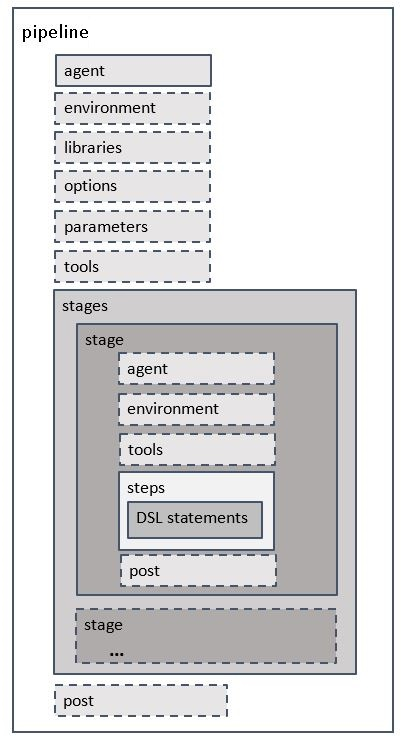

# Pipeline - declarative syntax

## hello

```groovy
pipeline {
    agent any
    stages {
        stage('Hello') {
            steps {
                echo('Hello Jenkins2')
//                sh 'echo "Hello Jenkins2"'
            }
        }
    }
}
```




---

## script

```groovy
def showInfo(p) { echo "Hi ${p.name}, you are ${p.age}" }
def person = ['name': 'jenkins', 'age': 5]

pipeline {
    agent any
    stages {
        stage('Hello') {
            steps {
                script { showInfo(person) }
            }
        }
    }
}
```


---

## triggers

`cron`

```groovy
pipeline {
    agent any
    triggers {
        cron('H(0-30)/20 * * * *')
    }
    stages {
        stage('Hello') {
            steps { echo 'Hello Jenkins2' }
        }
    }
}
```


`upstream`

```groovy
pipeline {
    agent any
    triggers {
        upstream(upstreamProjects: 'job1,job2',
                 threshold: hudson.model.Result.SUCCESS)
    }
    stages {
        stage('Hello') {
            steps { echo 'Hello Jenkins2' }
        }
    }
}
```


---

## input

```groovy
pipeline {
    agent any
    stages {
        stage('Hello') {
            input {
                message "Should continue?"
                parameters {
                    string(name: 'version', defaultValue: '1.0.0.0', description: '')
                }
 
            }
            steps { echo "Current Version: ${version}" }
        }
    }
}
```


---

## opt

```groovy
pipeline {
    agent any
    options { disableConcurrentBuilds() }
    stages {
        stage('Hello') {
            steps { sh 'sleep 5' }
        }
    }
}
```


---

## param

```groovy
pipeline {
    agent any
    parameters { string(name: 'version', defaultValue: '1.0.0.0', description: '') }
    stages {
        stage('Build') {
            steps { echo "Current Version: ${params.version}" }
        }
    }
}
```


---

## env

```groovy
pipeline {
    agent any
    environment {
        DB_ENGINE    = 'sqlite'
    }
    stages {
        stage('Hello') {
            steps {
                sh 'env'
                echo "${env.DB_ENGINE}"
                sh "echo $DB_ENGINE"
            }
        }
    }
}
```


---

## timeout, retry, waitUntil

```groovy
pipeline {
    agent any
    stages {
        stage('Hello') {
            steps {
                timeout(time: 3, unit: 'SECONDS') {
                    sh 'm=`date +%s`; n=`expr $m % 10`; echo $n && sleep $n'
                }

                retry(5) {
                    sh 'm=`date +%s`; n=`expr $m % 10`; echo $n; test $n -gt 5 && true || false'
                }

                waitUntil {
                    script {
                        def r = sh script: 'm=`date +%s`; n=`expr $m % 10`; echo $n; test $n -gt 5 && true || false', returnStatus: true
                        return (r == 0);
                    }
                }

                timeout(time: 3, unit: 'SECONDS') {
                    retry(5) {
                        sh 'm=`date +%s`; n=`expr $m % 10`; echo $n && sleep $n'
                    }

                    waitUntil {
                        script {
                            def r = sh script: 'm=`date +%s`; n=`expr $m % 10`; echo $n; test $n -gt 5 && true || false', returnStatus: true
                            return (r == 0);
                        }
                    }
                }
            }
        }
    }
}
```


---

## parallel

```groovy
pipeline {
    agent any
    stages {
        stage('task1') {
            steps { echo 'task1' }
        }
                
        stage('task2') {
            steps { echo 'task2' }
        }
        
        stage('parallel') {
            parallel {
                stage('task3') {
                    agent any
                    steps { echo 'task3' }
                }
                stage('task4') {
                    agent any
                    steps { echo 'task4' }
                }
            }
        }
    }
}
```


---

## when

```groovy
pipeline {
    agent any
    parameters {
        choice(name: 'stage', choices: ['SYNC', 'BUILD', 'DEPLOY', 'TEST'], description: '')
    }
    stages {
        stage('Sync') {
            steps { echo 'SYNC CODE' }
        }
        
        stage('Build') {
            when {
                anyOf {
                    expression { params.stage ==~ /BUILD/}
                    expression { params.stage ==~ /DEPLOY/}
                    expression { params.stage ==~ /TEST/}
                }
            }
            steps { echo 'BUILD PROJECT' }
        }
        
        stage('Deploy') {
            when { expression { params.stage ==~ /DEPLOY|TEST/} }
            steps { echo 'DEPLOY PACKAGE' }
        }
        
        stage('Test') {
            when { expression { params.stage ==~ /TEST/} }
            steps { echo 'TEST CASE' }
        }
    }
}
```


---

## post

```groovy
pipeline {
    agent any
    stages {
        stage('Robotframework') {
            steps {
                sh 'cat << EOF > hello.robot\n*** Test Cases ***\nHello\n    Log  Hello\nEOF'
                sh ' python -m robot hello.robot'
                pwd()
            }
        }
    }
    post {
        always {
            step([
                    $class : 'RobotPublisher',
                    outputPath : '/var/jenkins_home/workspace/declarative-post',
                    outputFileName : "*.xml",
                    disableArchiveOutput : false,
                    passThreshold : 100,
                    unstableThreshold: 95.0,
                    otherFiles : "*.png",
                ]
            )
        }
    }
}
```


---

## library

```
(root)
+- vars
|   +- log.groovy
|   +- sayHello.groovy
```

```groovy
// log.groovy
def info(message) {
    echo "INFO: ${message}"
}
```

```groovy
// sayHello.groovy
def call(String name = 'human') {
  echo "Hello ${name}"
}
```

`global`

```
@Library('global-library@master') _

pipeline {
    agent any
    stages {
        stage('vars') {
            steps {
                sayHello 'Jenkins'
                script {
                    log.info 'info message'
                }
            }
        }
    }
}
```

`dynamic`

```groovy
library identifier: 'dynamic-libary@master', retriever: modernSCM(
  [$class: 'GitSCMSource',
   remote: 'https://git/jenkins-example.git'])

pipeline {
    agent any
    stages {
        stage('vars') {
            steps {
                sayHello 'Jenkins'
                script {
                    log.info 'info message'
                }
            }
        }
    }
}
```


---

## Example

```groovy
pipeline {
    agent any
    parameters { string(name: 'version', defaultValue: '1.2.3.4', description: '') }

    stages {
        stage('Show') {
            steps {
                script {
                    currentBuild.displayName = "${version} - #${currentBuild.number}"
                }

                echo "Current Version: ${params.version}"
                sh '''#!/bin/bash
echo "${version}"
'''
            }
        }

        stage('S1') {
            steps {
                build job: 'any_job'
            }
        }
        
        stage('S2') {
            steps {
                build job: 'always_false', propagate: false
                // build job: 'always_false'
            }
        }
        
        stage('S3') {
            steps {
                catchError {
                    build job: 'always_false'
                }
                echo "Stage ${currentBuild.result}, but we continue"  
            }
        }

        stage('S5') {
            steps {
                build job: 'any_job', parameters: [string(name: 'version', value: "${params.version}")]
            }
        }

    }
}
```

---

## Ref

[Pipeline Syntax](https://jenkins.io/doc/book/pipeline/syntax/)

[Pipeline Examples](https://jenkins.io/doc/pipeline/examples/)
