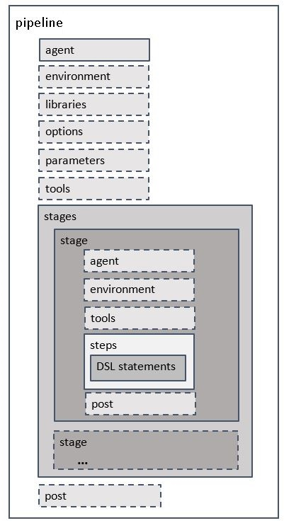

# Pipeline - declarative syntax

## hello

```groovy
pipeline {
    agent any
    stages {
        stage('Hello') {
            steps {
                echo('Hello Jenkins2')
//                sh 'echo "Hello Jenkins2"'
            }
        }
    }
}
```



---

## script

```groovy
def showInfo(p) { echo "Hi ${p.name}, you are ${p.age}" }
def person = ['name': 'jenkins', 'age': 5]

pipeline {
    agent any
    stages {
        stage('Hello') {
            steps {
                script { showInfo(person) }
            }
        }
    }
}
```

---

## triggers

`cron`

```groovy
pipeline {
    agent any
    triggers {
        cron('H(0-30)/20 * * * *')
    }
    stages {
        stage('Hello') {
            steps { echo 'Hello Jenkins2' }
        }
    }
}
```

`upstream`

```groovy
pipeline {
    agent any
    triggers {
        upstream(upstreamProjects: 'job1,job2',
                 threshold: hudson.model.Result.SUCCESS)
    }
    stages {
        stage('Hello') {
            steps { echo 'Hello Jenkins2' }
        }
    }
}
```

---

## input

```groovy
pipeline {
    agent any
    stages {
        stage('Hello') {
            input {
                message "Should continue?"
                parameters {
                    string(name: 'version', defaultValue: '1.0.0.0', description: '')
                }

            }
            steps { echo "Current Version: ${version}" }
        }
    }
}
```

---

## opt

```groovy
pipeline {
    agent any
    options { disableConcurrentBuilds() }
    stages {
        stage('Hello') {
            steps { sh 'sleep 5' }
        }
    }
}
```

---

## param

```groovy
pipeline {
    agent any
    parameters { string(name: 'version', defaultValue: '1.0.0.0', description: '') }
    stages {
        stage('Build') {
            steps { echo "Current Version: ${params.version}" }
        }
    }
}
```

---

## env

```groovy
pipeline {
    agent any
    environment {
        DB_ENGINE    = 'sqlite'
    }
    stages {
        stage('Hello') {
            steps {
                sh 'env'
                echo "${env.DB_ENGINE}"
                sh "echo $DB_ENGINE"
            }
        }
    }
}
```

---

## timeout, retry, waitUntil

```groovy
pipeline {
    agent any
    stages {
        stage('Hello') {
            steps {
                timeout(time: 3, unit: 'SECONDS') {
                    sh 'm=`date +%s`; n=`expr $m % 10`; echo $n && sleep $n'
                }

                retry(5) {
                    sh 'm=`date +%s`; n=`expr $m % 10`; echo $n; test $n -gt 5 && true || false'
                }

                waitUntil {
                    script {
                        def r = sh script: 'm=`date +%s`; n=`expr $m % 10`; echo $n; test $n -gt 5 && true || false', returnStatus: true
                        return (r == 0);
                    }
                }

                timeout(time: 3, unit: 'SECONDS') {
                    retry(5) {
                        sh 'm=`date +%s`; n=`expr $m % 10`; echo $n && sleep $n'
                    }

                    waitUntil {
                        script {
                            def r = sh script: 'm=`date +%s`; n=`expr $m % 10`; echo $n; test $n -gt 5 && true || false', returnStatus: true
                            return (r == 0);
                        }
                    }
                }
            }
        }
    }
}
```

---

## parallel

```groovy
pipeline {
    agent any
    stages {
        stage('task1') {
            steps { echo 'task1' }
        }

        stage('task2') {
            steps { echo 'task2' }
        }

        stage('parallel') {
            parallel {
                stage('task3') {
                    agent any
                    steps { echo 'task3' }
                }
                stage('task4') {
                    agent any
                    steps { echo 'task4' }
                }
            }
        }
    }
}
```

---

## when

```groovy
pipeline {
    agent any
    parameters {
        choice(name: 'stage', choices: ['SYNC', 'BUILD', 'DEPLOY', 'TEST'], description: '')
    }
    stages {
        stage('Sync') {
            steps { echo 'SYNC CODE' }
        }

        stage('Build') {
            when {
                anyOf {
                    expression { params.stage ==~ /BUILD/}
                    expression { params.stage ==~ /DEPLOY/}
                    expression { params.stage ==~ /TEST/}
                }
            }
            steps { echo 'BUILD PROJECT' }
        }

        stage('Deploy') {
            when { expression { params.stage ==~ /DEPLOY|TEST/} }
            steps { echo 'DEPLOY PACKAGE' }
        }

        stage('Test') {
            when { expression { params.stage ==~ /TEST/} }
            steps { echo 'TEST CASE' }
        }
    }
}
```

---

## post

### [Robot Framework](https://plugins.jenkins.io/robot/)

```groovy
pipeline {
    agent any
    stages {
        stage('Robotframework') {
            steps {
                sh 'cat << EOF > hello.robot\n*** Test Cases ***\nHello\n    Log  Hello\nEOF'
                sh ' python -m robot hello.robot'
                pwd()
            }
        }
    }
    post {
        always {
            step([
                    $class : 'RobotPublisher',
                    outputPath : '/var/jenkins_home/workspace/declarative-post',
                    outputFileName : "*.xml",
                    disableArchiveOutput : false,
                    passThreshold : 100,
                    unstableThreshold: 95.0,
                    otherFiles : "*.png",
                ]
            )
        }
    }
}
```

---

## library

```
(root)
+- vars
|   +- log.groovy
|   +- sayHello.groovy
```

```groovy
// log.groovy
def info(message) {
    echo "INFO: ${message}"
}
```

```groovy
// sayHello.groovy
def call(String name = 'human') {
  echo "Hello ${name}"
}
```

`global`

```
@Library('global-library@master') _

pipeline {
    agent any
    stages {
        stage('vars') {
            steps {
                sayHello 'Jenkins'
                script {
                    log.info 'info message'
                }
            }
        }
    }
}
```

`dynamic`

```groovy
library identifier: 'dynamic-libary@master', retriever: modernSCM(
  [$class: 'GitSCMSource',
   remote: 'https://git/jenkins-example.git'])

pipeline {
    agent any
    stages {
        stage('vars') {
            steps {
                sayHello 'Jenkins'
                script {
                    log.info 'info message'
                }
            }
        }
    }
}
```

---

## example

```groovy
pipeline {
    agent any
    parameters { string(name: 'version', defaultValue: '1.2.3.4', description: '') }

    stages {
        stage('Show') {
            steps {
                script {
                    currentBuild.displayName = "${version} - #${currentBuild.number}"
                }

                echo "Current Version: ${params.version}"
                sh '''#!/bin/bash
echo "${version}"
'''
            }
        }

        stage('S1') {
            steps {
                build job: 'any_job'
            }
        }

        stage('S2') {
            steps {
                build job: 'always_false', propagate: false
                // build job: 'always_false'
            }
        }

        stage('S3') {
            steps {
                catchError {
                    build job: 'always_false'
                }
                echo "Stage ${currentBuild.result}, but we continue"
            }
        }

        stage('S5') {
            steps {
                build job: 'any_job', parameters: [string(name: 'version', value: "${params.version}")]
            }
        }

    }
}
```

---

## lock

```groovy
pipeline {
    agent any
    // lock resource
    options {
        lock (resource: 'lockResource1 lockResource2', quantity: 1)
    }
    parameters {
        string(name: 'VER', defaultValue: '1.0', description: '')
    }
    stages {
        stage('Run') {
            steps {
                script {
                    currentBuild.displayName = "${currentBuild.number} - ${VER}"
                }
                echo "$VER"
                sleep 10
            }
        }
    }
}
```

```groovy
pipeline {
    agent any
    // lock resource
    options {
        lock (label: 'lockLabel')
    }
    parameters {
        string(name: 'VER', defaultValue: '1.0', description: '')
    }
    stages {
        stage('Run') {
            steps {
                script {
                    currentBuild.displayName = "${currentBuild.number} - ${VER}"
                }
                echo "$VER"
                sleep 10
            }
        }
    }
}
```

```groovy
pipeline {
    agent any
    // lock resource by label
    options {

    }
    parameters {
        string(name: 'VER', defaultValue: '1.0', description: '')
    }
    stages {
        stage('Run') {
            steps {
                script {
                    currentBuild.displayName = "${currentBuild.number} - ${VER}"
                }
                // lock resource
                lock (resource: 'lockResource') {
                    echo "$VER"
                    sleep 10
                }
            }
        }
    }
}
```

---

## plugin

### [Parameterized Scheduler](https://plugins.jenkins.io/parameterized-scheduler/)

```groovy
pipeline {
    agent any
    parameters {
        string(name: 'MSG', defaultValue: 'hello', description: '')
        string(name: 'NAME', defaultValue: 'world', description: '')
    }
    triggers {
        cron('H/2 * * * *')
        parameterizedCron('''
*/2 * * * * %MSG=hi;NAME=jenkins2
H/2 * * * * %MSG=nice;NAME=pipeline
        ''')

    }
    stages {
        stage('Run') {
            steps {
                script {
                    currentBuild.displayName = "${currentBuild.number} - ${MSG} ${NAME}"
                }
                echo "$MSG $NAME" }
        }
    }
}
```

---

## git

```groovy
pipeline {
    agent {
        node { label 'node' }
    }
    options {
        lock (resource: 'spTestjob')
    }
    parameters {
        string(name: 'TAG',                  defaultValue: 'master--latest', description: 'Service image version')
    }

    stages {
        stage('sync code') {
            steps {
                git branch: 'master',
                    credentialsId: 'abcd1234-abcd-1234-ab12-abcdef123456',
                    url: 'ssh://git@myrepo.git'
                script {
                    currentBuild.displayName = "#${currentBuild.number} - ${TAG}"
                }

            }
        }

        stage('run') {
            steps {
                sh '''#!/bin/bash
pwd
'''
            }
        }
    }

}
```

```groovy
pipeline {
    agent {
        node { label 'node' }
    }
    options {
        lock (resource: 'spTestjob')
    }
    parameters {
        string(name: 'TAG',                     defaultValue: 'master--latest', description: 'Service image version')
    }

    stages {
        stage('sync code') {
            steps {
// https://plugins.jenkins.io/git/
// https://www.jenkins.io/doc/pipeline/steps/git/
// https://www.jenkins.io/doc/pipeline/steps/params/gitscm/
                checkout([$class: 'GitSCM',
                    branches: [[name: "master"]],
                    doGenerateSubmoduleConfigurations: false,
                    extensions: [[$class: 'CloneOption', timeout: 30]],
                    gitTool: 'Default',
                    submoduleCfg: [],
                    userRemoteConfigs: [[
                        credentialsId: 'abcd1234-abcd-1234-ab12-abcdef123456',
                        url: 'ssh://git@myrepo.git'
                    ]]
                ])
                script {
                    currentBuild.displayName = "#${currentBuild.number} - ${TAG}"
                }
                script {
                    def cmds =["ls", "pwd", "whoami", "hostname"]
                    cmds.each {
                    println it.execute().text
                    }
                }
                script {
                    String cmd1 = 'println InetAddress.localHost.hostAddress'
                    String cmd2 = 'println InetAddress.localHost.canonicalHostName'
                    String cmd3 = 'def proc = "uname -a".execute(); proc.waitFor(); println proc.in.text'
                    def cmds = [cmd1, cmd2, cmd3]

                    hudson.model.Hudson.instance.slaves.each { slave ->
                        println hudson.util.RemotingDiagnostics.executeGroovy(print_ip, slave.getChannel());
                        println hudson.util.RemotingDiagnostics.executeGroovy(print_hostname, slave.getChannel());
                        println hudson.util.RemotingDiagnostics.executeGroovy(uname, slave.getChannel());
                    }
                }
            }

        stage('run') {
            steps {
                sh '''#!/bin/bash
pwd
'''
            }
        }
    }

}
```

---

## Ref

[Pipeline Syntax](https://jenkins.io/doc/book/pipeline/syntax/)

[Pipeline Examples](https://jenkins.io/doc/pipeline/examples/)
